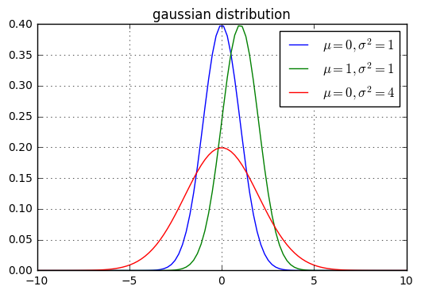
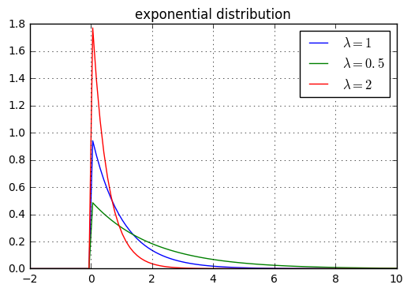
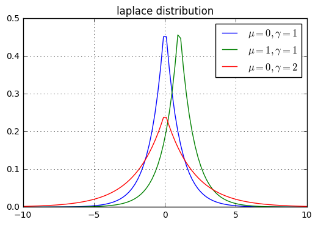
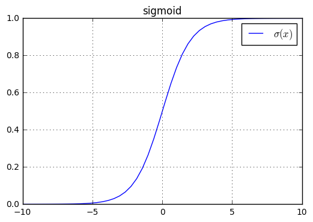
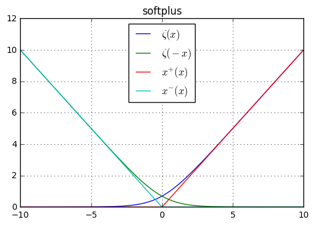
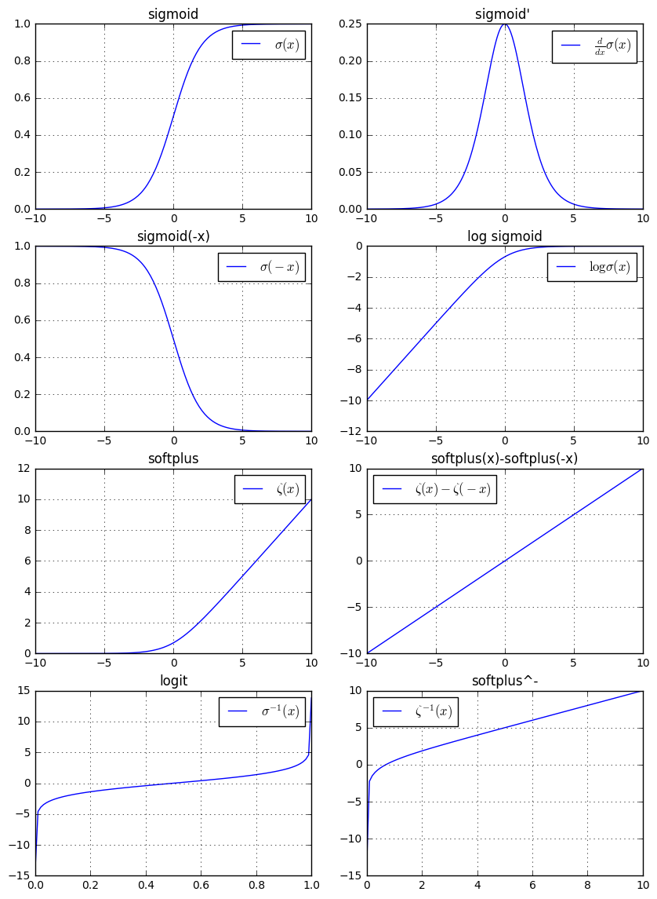

# 章3 概率论和信息论

## 一、基本概念
1. 机器学习中，不确定性有三个来源:
	- 模型本身固有的随机性。如量子力学中的粒子动力学方程。
	- 不完全的观测。即使是确定性系统，当我们无法观测所有驱动变量时，结果也是随机的。
	- 不完全建模。有时我们必须放弃一些观测信息。如机器人建模中，我们可以精确观察机器人周围每个对象的位置。但在预测这些对象将来的位置时，对空间进行了离散化，那么位置预测将带有不确定性。

2. 离散随机变量的均匀分布：假设 \\(\mathbf x\\)  有 \\(k\\) 个取值： \\(x_1,x_2,\cdots,x_k\\)，则均匀分布的概率密度函数(`probability mass function:PMF`)为：
	$$P(\mathbf x=x_i) =\frac 1k,\quad i=1,2,\cdots,k$$
3. 连续随机变量的均匀分布： 假设  \\(\mathbf x\\) 在 `[a,b]`上均匀分布，则其概率密度函数(`probability density function：PDF`)为：
	$$p(\mathbf x=x)=\begin{cases}
	0,&x\notin [a,b]\\\
	\frac{1}{b-a},&x \in [a,b]
	\end{cases} $$

4. 条件概率分布的链式法则：对于 \\(n\\) 个随机变量 \\(\mathbf x\_1,\mathbf x\_2,\cdots,\mathbf x\_n\\)，有：
	$$ P(\mathbf x\_1,\mathbf x\_2,\cdots,\mathbf x\_n)=P(\mathbf x\_1)\prod\_{i=2}^{n}P(\mathbf x\_i \mid \mathbf x\_1,\cdots,\mathbf x\_{i-1})$$

5. 两个随机变量 \\(\mathbf x,\mathbf y\\) 相互独立的数学描述：
	$$ \forall x\in \mathbf x,\forall y\in \mathbf y, p(\mathbf x=x,\mathbf y=y)=p(\mathbf x=x)p(\mathbf y=y)$$
	记作： \\(\mathbf x \bot \mathbf y\\)

6. 两个随机变量 \\(\mathbf x,\mathbf y\\) 关于随机变量 \\(\mathbf z\\) 条件独立的数学描述：
	$$ \forall x\in \mathbf x,\forall y\in \mathbf y,\forall z \in\mathbf z,\\\
 p(\mathbf x=x,\mathbf y=y\mid \mathbf z=z)=p(\mathbf x=x\mid \mathbf z=z)p(\mathbf y=y\mid \mathbf z=z)$$
	记作： \\(\mathbf x \bot \mathbf y \mid \mathbf z\\)

7. 期望：
	- 离散型随机变量： \\(\mathbb E\_{\mathbf x\sim P}[f(x)]=\sum\_{x}P(x)f(x)\\)
	- 连续型随机变量： \\(\mathbb E\_{\mathbf x\sim p}[f(x)]=\\int p(x)f(x)dx\\)

	方差： \\(Var(f(x))=\mathbb E[(f(x)-\mathbb E[f(x)])^{2}]\\)

8. 两个随机变量之间的协方差，它刻画了两个随机变量的线性相关的程度：
	$$Cov(f(x),g(y))=\mathbb E[(f(x)-\mathbb E[f(x)])(g(y)-\mathbb E[g(y)])] $$
	- 协方差的绝对值越大，说明两个随机变量都远离它们的均值。
	- 协方差如果为正，则说明两个随机变量同时趋向于取较大的值；如果为负，则说明一个随变量趋向于取较大的值，另一个随机变量趋向于取较小的值

	两个随机变量的相关系数是归一化的协方差，它仅保留了线性相关的程度。

	两个随机变量的独立性可以导出协方差为零。但是两个随机变量的协方差为零无法导出独立性，因为独立性也包括：没有非线性关系。有可能两个随机变量是非独立的，但是协方差为零：假设随机变量 \\(\mathbf x\sim U[-1,1]\\) 。定义随机变量 \\(\mathbf s\\) 的概率分布函数为：
	$$P(\mathbf s=1)= \frac 12\\\P(\mathbf s=-1)= \frac 12
	$$
	定义随机变量 \\(\mathbf y=\mathbf {sx}\\)，则随机变量 \\(\mathbf x,\mathbf y\\) 是非独立的，但是有： \\(Cov(\mathbf x,\mathbf y)=0\\)

9. 给定随机向量 \\(\mathbf{\vec x}\in \mathbb R^{n}\\)，则协方差矩阵为一个 \\(n\times n\\) 大小的矩阵，每个元素为：
	$$Cov(\mathbf{\vec x})\_{i,j}=Cov(\mathbf x_i,\mathbf x_j) $$
	对角线元素为方差： \\(Cov(\mathbf{\vec x})\_{i,i}=Var(\mathbf x_i)\\)

## 二、常见概率分布
1. 伯努利分布（二项分布）：参数为 \\(\phi\in [0,1]\\)。随机变量 \\(\mathbf x \in \\{0,1\\}\\)
	- 概率分布函数为：
	$$ P(\mathbf x=x)=\phi^{x}(1-\phi)^{1-x}\;,x \in \\{0,1\\}$$
	- 期望： \\(\mathbb E\_{\mathbf x}[x]=\phi\\)
	- 方差： \\(Var\_{\mathbf x}[x]=\phi(1-\phi)\\)

2. `categorical` 分布：它是二项分布的推广，也称作`multinoulli`分布。假设随机变量 \\(\mathbf x \in \\{1,2,\cdots,K\\}\\)，其概率分布函数为：
	$$
	P(\mathbf x=1)=\theta_1\\\
	P(\mathbf x=2)=\theta_2\\\
	\vdots\\\
	P(\mathbf x=K-1)=\theta\_{K-1}\\\
	P(\mathbf x=K)=1-\sum\_{i=1}^{K-1}\theta\_i\\\
	$$
	其中\\(\theta_i\\) 为参数，它满足 \\(\theta_i \in [0,1]\\)，且 \\(\sum\_{i=1}^{K-1}\theta\_i \in [0,1]\\) 。

3. 高斯分布（正态分布）：
	- 概率密度函数：
	$$\mathcal N(x;\mu,\sigma^{2}) =\sqrt{\frac{1}{2\pi\sigma^{2}}}\exp\left(-\frac{1}{2\sigma^{2}}(x-\mu)^{2}\right)$$
	- 期望：  \\(\mathbb E\_{\mathbf x}[x]=\mu\\)
	- 方差： \\(Var\_{\mathbf x}[x]=\sigma^{2}\\)

	为了计算方便，有时也记作：
	$$\mathcal N(x;\mu,\beta^{-1}) =\sqrt{\frac{\beta}{2\pi}}\exp\left(-\frac{1}{2}\beta(x-\mu)^{2}\right) $$
	其中 \\(\beta \in (0,\infty)\\)

	正态分布是很多应用中的合理选择。如果某个随机变量取值范围是实数，且我们对它的概率分布一无所知，通常我们会假设它服从正态分布。有两个原因支持这一选择：
	- 我们建模的任务的真实分布通常都确实接近正态分布。中心极限定理表明，多个独立随机变量的和近似正态分布。
	- 在具有相同方差的所有可能的概率分布中，正态分布的熵最大（即不确定性最大）。

	

4. 多元正态分布：
	- 概率密度函数（假设 \\(\mathbf{\vec x}\in \mathbb R^{n}\\) ）：
	$$\mathcal N(\mathbf{\vec x};\mathbf{\vec \mu},\mathbf\Sigma) =\sqrt{\frac{1}{(2\pi)^{n}det(\mathbf\Sigma)}}\exp\left(-\frac 12(\mathbf{\vec x-\vec \mu})^{T}\mathbf\Sigma^{-1}(\mathbf{\vec x-\vec \mu})\right) $$
	- 期望：  \\(\mathbb E\_{\mathbf{\vec x}}[\mathbf{\vec x}]=\mathbf{\vec \mu}\\)
	- \\(\mathbf\Sigma\\) 给出了协方差矩阵

5. 指数分布：
	- 概率密度函数：
	$$p(x;\lambda)=\begin{cases}
	0,& x\lt0\\\
	\frac{\lambda}{\exp(\lambda x)},& x\ge0
	\end{cases} $$
	- 期望：  \\(\mathbb E\_{\mathbf x}[x]=\frac{1}{\lambda}\\)
	- 方差： \\(Var\_{\mathbf x}[x]=\frac{1}{\lambda^{2}}\\)

	

6. 拉普拉斯分布：
	- 概率密度函数：
	$$p(x;\mu,\gamma)=\frac{1}{2\gamma}\exp\left(-\frac{|x-\mu|}{\gamma}\right) $$
	- 期望：  \\(\mathbb E\_{\mathbf x}[x]=\mu\\)
	- 方差： \\(Var\_{\mathbf x}[x]=2\gamma^{2}\\)
	

7. 狄拉克分布：假设所有的概率都集中在一点 \\(\mu\\) 上，则对应的概率密度函数为：
	$$p(x)=\delta(x-\mu) $$
	其中 \\(\delta(\cdot)\\) 为狄拉克函数，其性质为：
	$$
	\delta(x)=0,\forall x\neq 0\\\
	\int\_{-\infty}^{\infty}\delta(x)dx=1 
	$$

	狄拉克分布的一个典型用途就是定义连续型随机变量的经验分布函数。假设数据集中有样本 \\(\mathbf{\vec x}\_1,\mathbf{\vec x}\_2,\cdots,\mathbf{\vec x}\_N\\)，则定义经验分布函数：
	$$ \hat p(\mathbf{\vec x})=\frac 1N\sum\_{i=1}^{N}\delta(\mathbf{\vec x}-\mathbf{\vec x}\_i)$$
	它就是对每个样本赋予了一个概率质量 \\(\frac 1N\\)。
	> 对于离散型随机变量的经验分布，则经验分布函数就是`multinoulli`分布，它简单地等于训练集中的经验频率。

	经验分布的两个作用：
	- 我们可以查看训练集样本的经验分布，从而指定该训练集的样本采样的分布
	- 经验分布就是使得训练数据的可能性最大化的概率密度函数

8. 混合概率分布：它组合了其他几个分量的分布来组成。在每次生成样本中，首先通过`multinoulli`分布来决定选用哪个分量，然后由该分量的分布函数来生成样本。

	其概率分布函数为：
	$$ P(\mathbf x)=\sum\_{i}P(c=i)P(\mathbf x\mid c=i)$$
	其中 \\(P(c=i)\\) 为一个`multinoulli`分布，\\(c\\) 的取值范围就是各分量的编号。

	- 前面介绍的连续型随机变量的经验分布函数就是一个混合概率分布的例子，此时 \\(P(c=i)=\frac 1N\\)
	- 混合概率分布可以通过简单的概率分布创建更复杂的概率分布
	- 一个常见的例子是混合高斯模型，其中 \\(P(\mathbf x\mid c=i)\\) 为高斯模型。每个分量都有对应的参数 \\((\mathbf{\vec \mu}\_i,\mathbf \Sigma\_i)\\)
		- 有些混合高斯模型有更强的约束，如 \\(\forall i,\mathbf \Sigma\_i=\mathbf\Sigma\\)，更进一步还可以要求 \\(\mathbf\Sigma\\) 为一个对角矩阵。
		- 混合高斯模型是一个通用的概率密度函数逼近工具。任何平滑的概率密度函数都可以通过足够多分量的混合高斯模型来逼近。

## 三、常用函数
1. `sigmoid`函数：
	$$\sigma(x)=\frac{1}{1+\exp(-x)} $$
	- 该函数可以用于生成二项分布的 \\(\phi\\) 参数
	- 当 \\(x\\) 很大或者很小时，该函数处于饱和状态。此时函数的曲线非常平坦，并且自变量的一个较大的变化只能带来函数值的一个微小的变化（即对自变量不敏感）。
	

2. `softplus`函数：
	$$ \zeta(x)=\log(1+\exp(x))$$
	- 该函数可以生成正态分布的 \\(\sigma^{2}\\) 参数
	- 它之所以称作`softplus`，因为它是下面函数的一个光滑逼近：
	$$x^{+}=\max(0,x) $$
	 

3. `sigmoid`和`softplus`函数的性质：
	$$
	\sigma(x)=\frac{\exp(x)}{\exp(x)+\exp(0)}\\\
	\frac {d}{dx}\sigma(x)=\sigma(x)(1-\sigma(x))\\\
	1-\sigma(x)=\sigma(-x)\\\
	\log\sigma(x)=-\zeta(-x)\\\
	\frac{d}{dx}\zeta(x)=\sigma(x)\\\
	\forall x\in(0,1),\sigma^{-1}(x)=\log(\frac{x}{1-x})\\\
	\forall x \gt 0,\zeta^{-1}(x)=\log(\exp(x)-1)\\\
	\zeta(x)=\int\_{-\infty}^{x}\sigma(y)dy\\\
	\zeta(x)-\zeta(-x)=x
	$$

	其中 \\(f^{-1}(\cdot)\\) 为反函数。
	- \\(\sigma^{-1}(x)\\) 也称作`logit`函数
	- 如果定义两个函数 
	 $$x^{+}=\max(0,x),x^{-}=\max(0,-x) $$
	则它们分布获取了 \\(y=x\\) 的正部分和负部分。根据定义有：
	$$x=x^{+}-x^{-} $$
	而我们的  \\(\zeta(x)\\) 逼近的是 \\(x^{+}\\)，  \\(\zeta(-x)\\) 逼近的是 \\(x^{-}\\)，于是有：
	 $$\zeta(x)-\zeta(-x)=x $$
		 
	

## 四、连续随机变量
1. 测度为零：非正式化的提法是，如果集合中的点的数量可以忽略不计，则该集合的测度为零。如：二维空间中的直线的测度为零，而正方形的测度非零。

2. 几乎处处相等：不满足条件的那些点组成的集合的测度为零。

3. 假设随机变量 \\(\mathbf x,\mathbf y\\) 满足 \\(\mathbf y=g(\mathbf x)\\)，且函数 \\(g(\cdot)\\) 满足：处处连续、可导、且存在反函数。

	则有：
	$$p\_{\mathbf x}(x)=p\_{\mathbf y}(g(x)) \left|\frac{\partial g(x)}{\partial x}\right|$$
	或者等价地：
	$$p\_{\mathbf y}(y)=p\_{\mathbf x}(g^{-1}(y)) \left|\frac{\partial x}{\partial y}\right| 	$$

	如果扩展到高维空间，则有：
	$$p\_{\mathbf x}(\mathbf{\vec x})=p\_{\mathbf y}(g(\mathbf{\vec x})) \left|\det\left(\frac{\partial g(\mathbf{\vec x})}{\partial \mathbf{\vec x}}\right)\right| 			$$
	> 并不是 \\(p\_{\mathbf y}(y)=p\_{\mathbf x}(g^{-1}(y))\\)，这是因为 \\(g(\cdot)\\) 引起了空间扭曲，从而导致 \\(\int p\_{\mathbf y}(y)dy \neq 1\\) 。其实我们有：
	 $$|p\_{\mathbf y}(g(x))dy|=|p\_{\mathbf x}(x)dx| $$
	求解该方程，即得到上述解。

## 五、信息论
1. 信息论背后的原理是：从不太可能发生的事件中能学到更多的有用信息。
	- 发生可能性较大的事件包含较少的信息
	- 发生可能性较小的事件包含较多的信息
	- 独立事件包含额外的信息 

	对于事件 \\(\mathbf x=x\\)，定义自信息`self-information`为：
	 $$I(x)=-\log P(x) $$

2. 自信息仅仅处理单个输出。如果计算自信息的期望，它就是熵：
	 $$ H(\mathbf x)=\mathbb E\_{\mathbf x\sim P}[I(x)]=-\mathbb E\_{\mathbf x\sim P}[\log P(x)]$$
	记作 \\(H(P)\\)

3. `KL`散度：对于给定的随机变量 \\(\mathbf x\\),它的两个概率分布函数 \\(P(x)\\) 和 \\(Q(x)\\) 的区别可以用 `KL`散度来度量：
	$$D\_{KL}(P||Q)=\mathbb E\_{\mathbf x\sim P}\left[\log \frac{P(x)}{Q(x)}\right]\\\
	=\mathbb E\_{\mathbf x\sim P}\left[\log  P(x) -\log  Q(x) \right] $$
	- `KL`散度非负。当它为0时，当且仅当 `P`和`Q`是同一个分布（对于离散型随机变量），或者两个分布几乎处处相等（对于连续型随机变量）
	- \\(D\_{KL}(P||Q) \neq D\_{KL}(Q||P)\\)

4. 交叉熵`cross-entropy`：\\(H(P,Q)=H(P)+D\_{KL}(P||Q)=-\mathbb E\_{\mathbf x\sim P}\log Q(x)\\)

## 六、概率图
1.  机器学习算法通常涉及非常大量的随机变量的联合概率分布。通常这些随机变量之间很多都是条件无关的，如果使用单个函数来描述联合概率分布是非常低效的。

	我们的做法是：将联合概率分布函数分解成很多因子的乘积，每个因子只涉及少量的随机变量。这种因式分解可以大大减少描述分布函数所需的参数数量。

2. 有两种概率图模型：
	- 有向图：对每个随机变量 \\(\mathbf x_i\\)，设它的父结点集合代表的结点集合为 \\(Pa\_{\mathcal G}(\mathbf x_i)\\)，则联合概率分布函数分解为：
	 $$p(\mathbf{\vec x}) =\prod\_{i}p(\mathbf x_i\mid Pa\_{\mathcal G}(\mathbf x_i))$$
	- 无向图：无向图中，任何两个结点均有边连接的结点子集称为团`clique`。若 \\(\mathcal C\\)  是无向图的一个团，并且不能再加进任何一个结点使其成为一个更大的团，则称此\\(\mathcal C\\) 为最大团。对于每个最大团 \\(\mathcal C \_i\\)，对应一个因子 \\(\phi\_i(\mathcal C \_i)\\)。则联合概率分布函数分解为：
	$$p(\mathbf{\vec x}) =\frac 1Z \prod\_{i}\phi\_i(\mathcal C \_i)$$
	其中 \\(Z\\) 为归一化因子，确保 \\(\int p(\mathbf{\vec x}) d \mathbf{\vec x}=1\\)