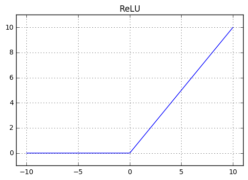
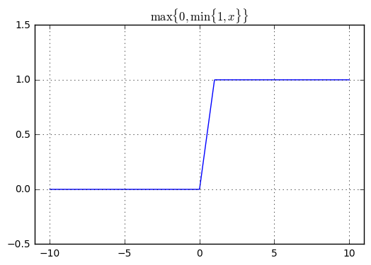
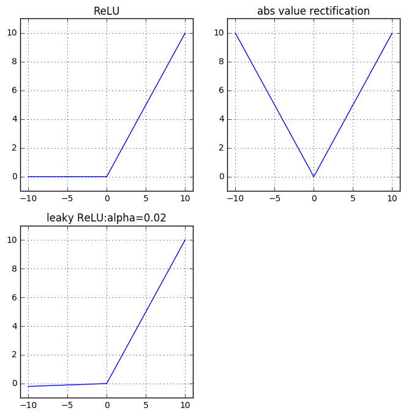
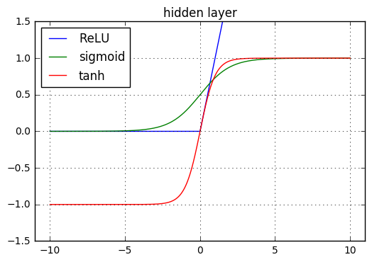
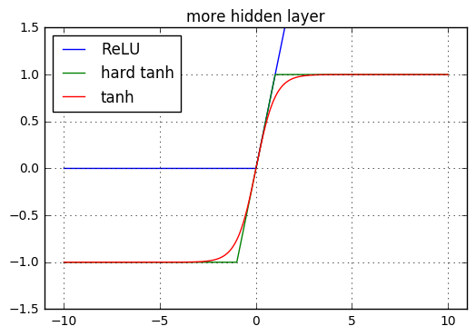
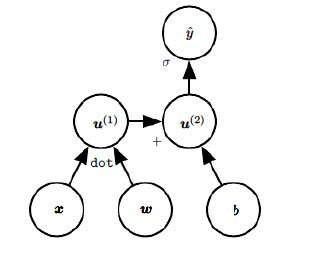
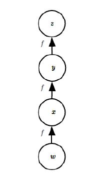
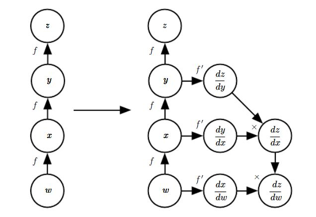

# 章6. 深度前馈网络

## 一、基础
### 1. 基本概念
1. 深度前馈网络（`deep feedfoward network`）也称作前馈神经网络（`feedforward neural network`）或者多层感知机（`multilayer perceptron:MLP`），它是典型的深度学习模型
	- 深度前馈网络的目标是：近似某个函数 \\(f^{\*}\\) 
		> 例如：分类器 \\(y=f^{\*}(\mathbf{\vec x})\\) 将输入  \\(\mathbf{\vec x}\\)  映射到它的真实类别 \\(y\\) 。深度前馈网络定义另一个映射  \\(y^{\prime}=f(\mathbf{\vec x};\theta)\\)，并且学习参数 \\(\theta\\) 从而使得 \\(f\\) 是 \\(f^{\*}\\)  的最佳近似。

2. 深度前馈网络之所以称作前馈的（`feedforward`），是因为：信息从输入 \\(\mathbf{\vec x}\\) 到输出是单向流动的，并没有从输出到模型本身的反馈连接。
	> 如果存在反馈连接，则这样的模型称作循环神经网络（`recurrent neural networks`）

3. 深度前馈网络非常重要。卷积神经网络就是一种特殊的深度前馈网络。深度前馈网络也是循环神经网络的基础。

4. 深度前馈网络通常使用许多不同的函数复合而成，这些函数如何复合则由一个有向无环图来描述。
	- 最简单的情况：有向无环图是链式结构。假设有三个函数 \\(f_1,f_2,f_3\\) 组成链式复合结构，则：
	$$f(\mathbf{\vec x})=f_3(f_2(f_1(\mathbf{\vec x}))) $$
	其中： \\(f_1\\) 被称作网络的第一层， \\(f_2\\) 为网络第二层，\\(f_3\\) 称为网络第三层。链的全长称作模型的深度。
	
	- 深度前馈网络的最后一层也称作输出层。输出层的输入为 \\(f_2(f_1(\mathbf{\vec x}))\\)，输出为 \\(f(\mathbf{\vec x})\\)
	- 给定训练样本 \\( (\mathbf{\vec x},y)\\)，要求输出层的输出 \\(f(\mathbf{\vec x}) \approx y\\)，但是对于其他层并没有任何要求。学习算法必须决定如何利用这些层来配合输出层来产生想要的结果。
	- 因为我们无法观测到除输出层以外的那些层的输出，因此那些层被称作隐层(`hidden layer`)
	- 通常每个隐层的输出都是一个向量而不是标量，这些隐层的输出向量的维数决定了深度前馈网络的宽度。
	> 我们也可以将每一层想象成由许多并行的单元组成，每个单元表示一个向量到标量的函数：函数的输入来自于许多其他的单元，然后根据单元自己的激活函数来计算单元的输出。因此每个单元类似于一个神经元。

### 2. 原理
1. 线性模型简单高效，且易于求解。但是它有个明显的缺陷：模型的能力被局限在线性函数中，因此它无法理解任意两个输入变量间的相互作用。

	解决线性模型缺陷的方法是：采用核技巧。我们将线性模型作用在 \\(\phi(\mathbf{\vec x})\\) 上，而不是原始输入 \\(\mathbf{\vec x}\\) 上。其中 \\(\phi\\) 是一个非线性变换。我们认为：通过 \\(\phi\\)，提供了 \\(\mathbf{\vec x}\\)  的一个新的`representation`。问题是：如何选择合适的非线性变换  \\(\phi\\) ？
	- 一个选择是使用一个通用的  \\(\phi\\)，如无限维的  \\(\phi\\)（采用基于 `RBF`核的核技巧）。当  \\(\phi\\) 具有足够高的维数，则我们总是有足够的能力来适应训练集，但是对于测试集的泛化往往不佳。这是因为：通用的  \\(\phi\\) 通常只是基于局部平滑的原则，并没有利用足够多的先验知识来解决高级问题。
	- 另一个选择是手动设计 \\(\phi\\) 。这种方法对于专门的任务往往需要数十年人们的努力（如语音识别任务）
	- 深度学习的方案是去学习  \\(\phi\\)。 以单层隐层的深度前馈网络为例：
	$$y=f(\mathbf{\vec x};\theta,\mathbf{\vec w})=\phi(\mathbf{\vec x};\theta)^{T}\mathbf{\vec w} $$
		此时我们有两个参数：
		- 参数 \\(\theta\\) ：从一族函数中学习 \\(\phi\\)   （其中 \\(\phi\\) 定义了一个隐层）
		- 参数 \\(\mathbf{\vec w}\\) ：将 \\(\phi(\mathbf{\vec x})\\) 映射到所需输出
		 

		这种方法是这三种方案中，唯一一个放弃了寻找待求解问题的凸性的方案，但是利大于弊。此方案中，我们将`representation`参数化为 \\(\phi(\mathbf{\vec x};\theta)\\)，并使用优化算法来寻找 \\(\theta\\) 从而得到一个很好的 `representation`。
		- 如果我们使用一个非常宽泛的函数族 \\(\phi(\mathbf{\vec x};\theta)\\)，则我们能获得第一种方案的好处。
		- 如果我们将人们的先验知识编码到函数族 \\(\phi(\mathbf{\vec x};\theta)\\) 中，则我们能获得第二种方案的好处。

		因此深度学习的方案中，人们只需要寻找合适的、宽泛的函数族 \\(\phi(\mathbf{\vec x};\theta)\\) ，而不是某一个映射函数 \\(\phi(\mathbf{\vec x})\\) 

2. 通过学习`representation`来改善模型不仅仅适用于前馈神经网络，它是深度学习中反复出现的主题，适用于几乎所有的深度学习模型。

3. 训练一个深度前馈网络和训练一个线性模型的选项相同：选择一个优化算法、代价函数、输出单元的形式。除此之外还需要给出下列条件：
	- 由于深度前馈网络引入了隐层的概念，因此需要选择适用于隐层的激活函数。激活函数接受隐层的输入值，给出了隐层的输出值。
	- 深度前馈网络的网络结构也需要给出，其中包括有多少层网络、每层网络有多少个单元、层级网络之间如何连接。

4. 深度神经网络的学习中需要计算复杂函数的梯度，通常这采用反向传播算法(`back propagation`)和它的现代推广来完成。

## 二、学习 XOR
1. `XOR`函数是两个二进制值 \\(x_1,x_2\\) 的运算，其中 \\(x_1,x_2 \in \\{0,1\\}\\)，要求：
	$$\text{xor}(0,1)= 1\\\
	\text{xor}(1,0)= 1\\\
	\text{xor}(0,0)= 0\\\
	\text{xor}(1,1)= 0$$
	设我们想要学习的目标函数为：\\(y=f^{\*}( \mathbf{\vec x})=\text{xor}(x_1,x_2)\\)，其中 \\(\mathbf{\vec x}=(x_1,x_2)^{T}\\)，即 \\(x_1,x_2\\)  为输入  \\(\mathbf{\vec x}\\) 的两个分量。

	假设我们的模型给出了一个函数 \\(\hat y=f(\mathbf{\vec x};\theta)\\)，我们期望学习参数 \\(\theta\\)，从而使得 \\(f\\) 尽可能接近 \\(f^{\*}\\) 

2. 我们考虑一个简单的数据集 \\(\mathbb X=\\{(0,0)^{T},(0,1)^{T},(1,0)^{T},(1,1)^{T}\\}\\) 。我们期望我们的模型 \\(f\\) 在这四个点上都尽可能接近 \\(f^{\*}\\) 。

	我们采用`MSE`损失函数为：
	$$ J(\theta)=\frac 14\sum\_{\mathbf{\vec x}\in \mathbb X}[f^{\*}( \mathbf{\vec x})-f(\mathbf{\vec x};\theta)]^{2}$$

3. 假设我们选择一个线性模型： \\(f(\mathbf{\vec x};\mathbf{\vec w},b)=\mathbf{\vec x}^{T}\mathbf{\vec w}+b\\)。

	通过最小化 \\( J(\theta)\\)，我们得到：
	$$\mathbf{\vec w}=\mathbf{\vec 0},\quad b=\frac 12 $$
	即： \\(f(\mathbf{\vec x};\mathbf{\vec w},b)=\frac 12\\)。这意味着：线性模型将在每一点都是输出 0.5 。

	从下图可知：当 \\(x_1=0\\) 时，函数的输出随着 \\(x_2\\) 的增加而增加；当 \\(x_1=1\\) 时，函数的输出随着 \\(x_2\\) 的增加而减少。因此导致了 \\(w_2=0\\)；同理 \\(w_1=0\\) 。

	

4. 假设我们采用一个简单的深度前馈网络。该网络结构如下，它有一层隐层，并且隐层中包含两个单元。

	
	- 第一层为隐层，对应于函数： \\(f_1(\mathbf{\vec x};\mathbf W,\mathbf{\vec c})\\)，其输入为 \\(\mathbf{\vec x}=(x_1,x_2)^{T}\\) ，输出为 \\(\mathbf{\vec h}=(h_1,h_2)^{T}\\)
	- 第二层为输出层，对应于函数：  \\(f_2(\mathbf{\vec h};\mathbf{\vec w},b)\\)，其输入为 \\(\mathbf{\vec h}\\) ，输出为 \\(\hat y\\) 。我们令输出层仍然是一个线性回归模型，即： \\(f_2(\mathbf{\vec h};\mathbf{\vec w},b)=\mathbf{\vec h}^{T} \mathbf{\vec w}+b\\)

	完整的模型为： \\(f(\mathbf{\vec x};\mathbf W,\mathbf{\vec c},\mathbf{\vec w},b)=f_2(f_1(\mathbf{\vec x}))\\)
	- 假设 \\(f_1\\) 也是线性的。暂时忽略截距项，令 \\(f_1(\mathbf{\vec x})=\mathbf W^{T}\mathbf{\vec x},f_2(\mathbf{\vec h})=\mathbf{\vec w}^{T}\mathbf{\vec h}\\)，则有：
	$$f(\mathbf{\vec x})=\mathbf{\vec w}^{T}\mathbf W^{T}\mathbf{\vec x} $$
	令： \\(\mathbf{\vec w}^{\prime}=\mathbf W\mathbf{\vec w}\\)，则有： \\(f(\mathbf{\vec x})=\mathbf{\vec x}^{T}\mathbf{\vec w}^{\prime}\\)，即：前馈神经网络整体也是线性的。
	-  \\(f_1\\)  必须是非线性函数。大多数神经网络先使用仿射变换，然后通过一个激活函数。激活函数不需要参数控制，仿射变换由参数控制。

	我们令 \\(\mathbf{\vec h}=g(\mathbf W^{T}\mathbf{\vec x}+\mathbf{\vec c})\\)，其中 \\(\mathbf W^{T}\mathbf{\vec x}+\mathbf{\vec c}\\) 就是仿射变换， \\(g(\cdot)\\) 为激活函数。现代神经网络中，默认推荐的激活函数为修正线性单元(`rectified linear unit:ReLU`)： \\(g(z)=\max\\{0,z\\}\\)
	> 由定义可知： \\(h_i=g((\sum\_{j}\mathbf{W}\_{j,i}\times x_j)+c_i)\\)
	
	

	因此我们的整个网络为： \\(f(\mathbf{\vec x};\mathbf W,\mathbf{\vec c},\mathbf{\vec w},b)=\mathbf{\vec w}^{T}\max\\{0,\mathbf W^{T}\mathbf{\vec x}+\mathbf{\vec c}\\}+b\\) 。我们给出其中一个解为：
	$$
	\mathbf W=\begin{bmatrix}
	1&1\\\
	1&1\end{bmatrix},\quad \mathbf{\vec c}=\begin{bmatrix}0\\\
	-1\end{bmatrix},\quad \mathbf{\vec w}=\begin{bmatrix}1\\\
	-2\end{bmatrix},\quad b=0
	$$

	令 \\(\mathbf X\\) 表示输入矩阵，每个样本占用一行。则对于输入空间中的全部四个点，输入矩阵为：
	$$\mathbf X=\begin{bmatrix}
	0&0\\\0&1\\\1&0\\\1&1
	\end{bmatrix} $$
	根据 \\(\mathbf{\vec h}=g(\mathbf W^{T}\mathbf{\vec x}+\mathbf{\vec c})\\) ，我们有：
	$$\mathbf H=\begin{bmatrix}
	0&0\\\1&0\\\1&0\\\2&1
	\end{bmatrix} $$
	\\(\mathbf H\\) 的每一行表示一个 \\(\mathbf{\vec h}\_i\\)  。可以看到：隐层改变了样本之间的关系。
	 

	将 \\(\mathbf H \mathbf{\vec w} +\mathbf{\vec 0}\\)，得到：
	$$
	\begin{bmatrix}0&0\\\0&1\\\1&0\\\1&1
	\end{bmatrix}\xrightarrow{f}
	\begin{bmatrix}0\\\1\\\1\\\0
	\end{bmatrix}
	$$

5. 在使用深度前馈网络逼近`xor`函数中，参数的求解可以通过简单的猜测来求解。但是对于复杂的函数逼近问题中，通常使用基于梯度的优化算法。
	- 这里给出的`xor`问题的解是损失函数的全局最小点，我们可以可以用梯度下降法找到该点
	- 梯度下降法的获得的解取决于参数的初值
	- 在实践中，梯度下降法通常难以找出容易理解的、整数值的解。

## 三、损失函数
1. 线性模型和神经网络的最大区别是：神经网络的非线性导致大多数的损失函数都是非凸的。

	损失函数非凸导致一个问题：基于梯度的优化算法仅仅能够使得损失函数到达一个非常小的值，而不是全局最小值。更重要的是：基于梯度的优化算法无法保证从任何一个初始参数都能收敛，它对于参数的初值非常敏感。
	>对于线性回归模型，我们可以直接求解出解析解。对于`logistic`回归或者`SVM`，其损失函数为凸的。凸优化算法可以保证全局收敛，而且理论上保证从任何一种参数出发都可以收敛（实际计算中，可能遇到数值稳定性问题）。

	对于前馈神经网络，我们通常将所有的权重值初始化为小的随机数，偏置 初始化为零或者小的正值。

2. 深度学习的一个重要方面是代价函数的选取。通常神经网络的代价函数与参数模型（如线性模型）的代价函数相同。
	- 大多数现代的神经网络采用最大似然准则，令代价函数为负的对数似然函数：
	$$J(\theta)=-\mathbb E\_{\mathbf{\vec x},y\sim \hat p\_{data}} \log p\_{model}(y\mid \mathbf{\vec x};\theta)  $$
	- 代价函数的具体形式取决于 \\(p\_{model}\\)的形式，随不同的模型而改变。
	> 如：当  \\( p\_{model}(y\mid \mathbf{\vec x};\theta)=\mathcal N(y;f(\mathbf{\vec x};\theta),\mathbf I)\\) 时， \\( J(\theta)=\frac 12 \mathbb E\_{\mathbf{\vec x},y\sim \hat p\_{data}}||y-f(\mathbf{\vec x};\theta)||^{2}+\text{const} \\)，常数项包含了高斯分布的方差（与 \\(\theta\\) 无关）。因此可以看到：此时的最大似然估计等价于最小均方误差。
	- 使用最大似然准则来导出代价函数的优势是：减轻了为每个模型设计代价函数的负担。明确了一个模型 \\(p\_{model}(y\mid \mathbf{\vec x})\\) ，则自动地确定了一个代价函数 \\(-\log p\_{model}(y\mid \mathbf{\vec x})\\)

3. 贯穿神经网络设计的一个重要的主题是：代价函数的梯度必须足够大且能够计算。
	- 如果代价函数非常平缓，则它使得代价函数的梯度非常小。梯度很小甚至消失，会导致迭代无法推进。
	- 当代价函数上溢出时，会出现问题。采用负的对数似然函数作为代价函数可以帮助我们避免这个问题。

4. 有的时候我们并不是希望得到一个完整的概率分布 \\(p(y\mid \mathbf{\vec x};\theta)\\)，而是某个条件统计量（比如条件期望、或者条件方差）。
	- 假设我们的代价函数为均方误差，我们要学习的是函数 \\(f\\)：
	$$f^{\*}=\arg\min\_f \mathbb E\_{\mathbf{\vec x},y\sim p\_{data}} || y-f(\mathbf{\vec x})||^{2}$$
	它是一个泛函的最优化问题，通过变分法解出：
	$$f^{\*}(\mathbf{\vec x})=\mathbb E\_{y\sim p\_{data}(y \mid \mathbf{\vec x})} [y]$$
	即：通过最小均方误差代价函数学得一个函数，它可以用于对每个 \\(\mathbf{\vec x}\\) 的值预测出 \\(y\\) 的均值

	- 假设我们的代价函数为平均绝对误差，我们要学习的是函数 \\(f\\)：
	$$f^{\*}=\arg\min\_f \mathbb E\_{\mathbf{\vec x},y\sim p\_{data}} || y-f(\mathbf{\vec x})||\_1$$
	它是一个泛函的最优化问题，通过变分法解解得一个函数，它可以用于对每个 \\(\mathbf{\vec x}\\) 的值预测出 \\(y\\) 的中位数。

	> 均方误差和平均绝对误差在使用基于梯度的优化方法时，经常会产生非常小的梯度。 

## 四、输出单元
1. 代价函数的选取和输出单元的类型紧紧相关。
2. 任何类型的输出单元，也可以用作隐单元。

### 1. 线性输出单元
1. 最简单的输出单元为线性单元：它基于仿射变换，不包含非线性。

2. 给定特征 \\(\mathbf{\vec h}\\)，线性输出单元的输出为： \\(\hat{y}=\mathbf{\vec w}^{T}\mathbf{\vec h}+b\\)
	- 输出层包含多个线性输出单元，因此输出层的输出为：  \\(\hat{\mathbf{\vec y}}=\mathbf{W}^{T}\mathbf{\vec h}+\mathbf{\vec b}\\)

3. 线性输出层经常用于学习条件高斯分布的均值： \\(p(\mathbf{\vec y}\mid \mathbf{\vec x})=\mathcal N(\mathbf{\vec y};\hat{\mathbf{\vec y}},\mathbf I)\\)。此时：最大化对数似然函数等价于最小化均方误差。
	> 最大似然准则也可以用于学习高斯分布的协方差矩阵。但是由于协方差矩阵的特点（对称的、正定的），因此用线性输出层来描述这种限制是困难的。所以通常采用其他类型的输出单元来学习协方差矩阵。

4. 因为线性模型不会饱和，因此可以毫无困难地使用基于梯度的优化算法。

### 2. sigmoid 输出单元

1. `sigmoid`单元：用于`Bernoulli`分布的输出。

2. 对于二类分类问题可以用伯努利分布来描述。由于伯努利分布只需要一个参数来定义，因此神经网络只需要预测 \\(P(y=1\mid \mathbf{\vec x})\\)，它必须位于区间 `[0,1]`之间。
	- 一种方案是采用线性单元，但是通过阈值来使它位于 `[0,1]`之间：
		$$ P(y=1\mid \mathbf{\vec x})=\max\\{0,\min\\{1,\mathbf{\vec w}^{T}\mathbf{\vec h}+b\\}\\}$$
		右侧就是函数 \\(\max\\{0,\min\\{1,z\\}\\}\\)，函数图象如下。该函数有个问题：当 \\(\mathbf{\vec w}^{T}\mathbf{\vec h}+b\\) 位于 `[0,1]`之外时，模型的输出对于它的参数的梯度都为 0。
		

	- 另一种方案就是采用 `sigmoid`单元：
		$$  P(y=1\mid \mathbf{\vec x})=\sigma(\mathbf{\vec w}^{T}\mathbf{\vec h}+b)$$
	其中 \\(\sigma(\cdot)\\) 就是`logistic sigmoid`函数。
		

3. `sigmoid`输出单元有两个部分：首先它用一个线性层来计算 \\(z=\mathbf{\vec w}^{T}\mathbf{\vec h}+b\\) ；然后它使用 `sigmoid`激活函数将 \\(z\\) 转化成概率。我们将上式写作：
	$$P(y=1\mid \mathbf{\vec x})=\sigma(z)=\frac{\exp(z)}{\exp(z)+\exp(0)} $$
	改作：
	$$P(y \mid \mathbf{\vec x})=\frac{\exp(yz)}{\sum\_{y^{\prime}} \exp(y^{\prime}z)} ,y \in \\{0,1\\}$$
	即： \\(P(y \mid \mathbf{\vec x})=\sigma((2y-1)z) \\)

3. 我们基于最大似然函数来学习`sigmoid`参数化的伯努利分布。其代价函数为：
	$$ J(\theta)=-\log P(y\mid \mathbf{\vec x})=-\log \sigma((2y-1)z)\\\
	= \zeta((1-2y)z)$$
	可以看到，只有当 \\((1-2y)z\\) 取一个非常大的负值时，代价函数才发生饱和。因此饱和只会发生在:
	-  \\(y=1\\) 且 \\(z\\) 为一个较大的正值
	- \\(y= 0\\) 且 \\(z\\) 为一个较大的负值

	当 \\(z\\) 符号错误时（即 \\(z\\) 为负数，而 \\(y=1\\) ；或者 \\(z\\) 为正数，但是  \\(y=0\\) ）， \\((1-2y)z=|z|\\)，于是 `softplus`函数会渐进地趋向于 \\(|z|\\)，且其梯度不会收缩。这意味着基于梯度的学习可以很快地改正错误的 \\(z\\)
	> 当使用其他损失函数时（如均方误差），损失函数会在任何 \\(\sigma(z)\\) 饱和时饱和，此时梯度会变得非常小从而无法学习。因此最大似然函数总是训练`sigmoid`输出单元的首选方法。

### 3. softmax 输出单元
1. `softmax`单元：用于`multinoulli`分布的输出。

2. 当我们要表示一个具有 \\(n\\) 个可能取值的离散型随机变量分布时，可以采用`softmax`函数。它可以视作`sigmoid`函数的扩展：
	$$
	\hat{\mathbf{\vec y}}=(\hat y_1,\hat y_2,\cdots,\hat y_K)^{T}\\\
	\mathbf{\vec z}=\mathbf W^{T}\mathbf{\vec h}+\mathbf{\vec b}\\\	
	\hat y_i=P(y=i\mid \mathbf{\vec x})=\text{softmax}(\mathbf{\vec z})\_i=\frac{\exp(z\_i) }{\sum\_j \exp(z_j)}
	$$

	-  对数似然函数为： \\(\log \text{softmax}(\mathbf{\vec z})\_i=z_i-\log\sum\_{j}\exp(z_j)\\)
		- 第一项 \\(z_i\\) 不会饱和（梯度不会为零）
		- 为了最大化对数似然函数，第一项鼓励 \\(z_i\\) 较大，第二项鼓励所有的 \\(z_j\\) 较小。
		- 第二项近似为 \\(\max\_j z_j\\) 。基于对数似然函数的代价函数为：  \\(-\log \text{softmax}(\mathbf{\vec z})\_i=\log\sum\_{j}\exp(z_j)-z_i\\)，因此代价函数惩罚那个最活跃的预测（最大的 \\(z_j\\) ）。如果 \\(z_i=\max\_j z_j\\)，则代价函数近似为零。

3. 除了对数似然之外，其他的许多目标函数对`softmax`函数不起作用（如均方误差损失函数）：当输入取较小的负数时，目标函数的梯度消失。

4. `softmax`函数本身也可能饱和，此时基于`softmax`函数的代价函数也饱和（除非它们能将`softmax`转化为成其它形式，如对数形式）。
	- 对于`softmax`函数，它有多个输出值；当输入值之间的差异较大时，这些输出值可能饱和。
	- 当某个输入最大(\\(z_i=\max\_i z_i\\))，且 \\(z_i\\) 远大于其他的输入时：
		-  \\(\text{softmax}(\mathbf{\vec z})\_i\\) 将饱和到 1
		-  \\(\text{softmax}(\mathbf{\vec z})\_j,j\ne i\\) 将饱和到 0
		
	这就是`sigmoid`单元饱和的一般化形式。如果代价函数不设计成对其进行补偿，那么梯度消失会造成学习困难。

5. 当所有输入都加上一个相同常数 时，`softmax`的输出不变。即 \\(\text{softmax}(\mathbf{\vec z})=\text{softmax}(\mathbf{\vec z}+c)\\) 。根据该性质，我们导出一个数值稳定的`softmax`函数的变体：
	$$ \text{softmax}(\mathbf{\vec z})=\text{softmax}(\mathbf{\vec z}-\max\_i z_i)$$

6. `softmax`函数是`argmax`函数的软化版本，而不是`max`函数的软化版本。
	- `argmax`函数的结果为一个独热向量（只有一个元素为1，其余元素都是0），且不可微
	- `softmax`函数是连续可微的。当某个输入最大(\\(z_i=\max\_i z_i\\))，且 \\(z_i\\) 远大于其他的输入时，对应的位置输出为1，其余的位置的输出为 0.
	- `max`函数的软化版本为 \\(\text{softmax}(\mathbf{\vec z})^{T}\mathbf{\vec z}\\)

### 4. 其他输出单元
1. 神经网络推广到任何其他类型的输出单元。
	- 最大似然准则为几乎任何类型的输出单元提供了如何设计一个良好的代价函数的指导。如果我们定义了一个条件分布 \\(p\_{model}(y\mid \mathbf{\vec x};\theta)\\)，则最大似然准则建议我们使用 \\(-\log p\_{model}(y\mid \mathbf{\vec x};\theta)\\) 作为代价函数。

2. 通常我们认为神经网络表示函数 \\(f(\mathbf{\vec x};\theta)\\)。但是该函数的输出并不是对标记值 \\(y\\) 的直接预测，而是为 \\(y\\) 的分布提供了参数（比如正态分布的均值、方差等参数）。
	- 令 \\(f(\mathbf{\vec x};\theta)=\eta(\mathbf{\vec x})\\)，则根据最大似然准则，我们的损失函数可以表示成：  \\(-\log p\_{model}(y\mid \eta(\mathbf{\vec x}))\\)
	- 比如我们想学习   \\(p\_{model}(y\mid \mathbf{\vec x};\theta) \\) 为高斯分布时的方差。
		- 最简单情况： \\(\sigma^{2}\\) 是个常数，此时有解析解。方差的最大似然估计量就是 \\(\frac 1m \sum\_{i}(y_i-\mathbb E[y])^{2}\\)
		- 在方差依赖于输入的情况下（对不同的 \\(\mathbf{\vec x}\\) 给出 \\(y\\) 的不同的方差），这种模型称作异方差模型。
		- 在多维变量的情况下，最常见的是使用一个对角精度矩阵 \\(diag(\beta)\\)（它就是协方差矩阵的逆矩阵 \\(\mathbf{\Sigma}^{-1}\\)）。因为如果直接使用协方差矩阵，则涉及到除法、求逆运算。而精度矩阵则只涉及乘法、加法运算。
		- 无论我们采用方差还是精度，必须确保高斯分布的协方差矩阵是正定的。通常我们采用协方差矩阵是对角矩阵，学习一个更复杂的协方差矩阵非常少见。

3. 有时我们想执行多模型回归：即预测条件分布 \\(p(y\mid \mathbf{\vec x})\\)，其中该条件分布在相同的 \\(\mathbf{\vec x}\\) 的情况下在多个不同的 \\(y\\) 处有峰值 。通常情况下我们使用高斯混合分布模型。将高斯混合分布作为输出单元的神经网络称作混合密度网络(`mixture density network`)。
		
	我们的模型定义为：
	$$p(y\mid \mathbf{\vec x})=\sum\_{i=1}^{n}p(c=i\mid \mathbf{\vec x})\mathcal N(y;\mathbf{\vec \mu}\_i(\mathbf{\vec x}),\mathbf{\Sigma}\_i(\mathbf{\vec x})) $$
	其中 \\(n\\) 为分量的数量； \\(p(c=i\mid \mathbf{\vec x})\\) 给出了\\(y\\) 由第 \\(i\\) 个分量产生的概率； \\(\mathbf{\vec \mu}\_i(\mathbf{\vec x})\\) 给出了第 \\(i\\) 个成分的均值向量；\\(\mathbf{\Sigma}\_i(\mathbf{\vec x})\\) 给出了第 \\(i\\) 个成分的协方差矩阵。要求：
	-  在 \\(n\\) 个不同成分上， \\(p(c=i\mid \mathbf{\vec x})\\)  形成了一个 `multinoulli`分布。该分布通常由 \\(n\\) 维向量的 `softmax`获取从而确保它们是正的，且和为 1.
	-  \\(\mathbf{\vec \mu}\_i(\mathbf{\vec x})\\)  是无约束的。如果 \\(y\\) 是一个 \\(d\\)  维向量，则所有的均值向量组成一个 \\(n\times d\\) 维的矩阵。
	-  \\(\mathbf{\Sigma}\_i(\mathbf{\vec x})\\) 是正定的。当学习单个高斯组件时，我们通常使用对角矩阵来避免计算行列式。但是学习混合高斯分布时，情况比较复杂。
	> 我们要学习的就是这三种参数。有报道说，基于梯度的优化算法对于混合条件高斯分布可能是不可靠的，部分原因是因为涉及到除法可能是数值不稳定的。一种解决方法是梯度截断，另一种方法是启发式梯度收缩。

	下图给出了由一个混合高斯单元生成的样本。\\(x\\) 由均匀分布产生； \\(y\\) 由分布 \\(p\_{model}(y \mid x)\\) 产生，该分布是一个混合高斯分布，有三个高斯成分。
	
	  
4. 高斯混合输出在语音生成模型和物理运动中特别有效。	

## 五、隐单元
1. 隐单元的设计是一个非常活跃的研究领域，并且木有还没有明确的指导性理论原则。

2. 通常默认采用的隐单元是修正线性单元，但是仍然有许多其他类型的隐单元。
	- 难以决定何时采用何种类型的隐单元
	- 通常不能预先判断那种类型的隐单元工作的最好，所以设计过程中需要反复试错，通过测试集评估其性能
3. 某些隐单元可能并不是在所有的输入上都是可微的。比如修正线性单元 \\(g(z)=\max\\{0,z\\}\\) 在 \\(z=0\\) 处不可微。这使得在该点处梯度失效。

	事实上梯度下降法对这些隐单元的表现仍然足够好。原因如下：
	- 神经网络的训练算法通常并不会达到代价函数的局部最小值，而仅仅是显著地降低代价函数的值即可。因此实际上我们并不期待训练过程中，能到达代价函数梯度为零的点。所以代价函数最小值时，梯度未定义是可以接受的。
	- 不可微的点通常只是在有限的、少数的点上不可微。神经网络中用到的函数通常左导数、右导数都存在。神经网络训练的软件实现通常返回左导数或者右导数其中的一个，而不是报告导数未定义或者产生一个错误。
	> 这是因为我们利用计算机计算 0 点的导数时，由于数值误差的影响，我们不可能计算到理论上 0 点的导数，而是一个微小的偏离。向左侧偏离就是左导数；向右侧偏离就是右导数。

4. 大多数隐单元的工作都可以描述为下面三步：
	- 接受输入向量 \\(\mathbf{\vec x}\\)
	- 计算仿射变换 \\(\mathbf{\vec z}=\mathbf W^{T}\mathbf{\vec x}+\mathbf{\vec b}\\)
	> 这是一层隐层的工作，其中该隐层由一组并行的隐单元组成
	- 用非线性函数 \\(g(z_i)\\) 作用于 \\(\mathbf{\vec z}\\) 的每个元素，该函数也称作激活函数

	大多数隐单元的区别仅仅在于激活函数   \\(g(z_i)\\) 的形式不同。

### 1. 修正线性单元

1. 修正线性单元：采用激活函数 \\(g(z)=\max\\{0,z\\}\\)
	- 修正线性单元易于优化。它和线性单元非常类似，区别在于：修正线性单元在左侧的定义域上输出为零。这使得当修正线性单元处于激活状态时，其导数较大且保持常数。
	- 修正线性单元的二阶导数几乎处处为零；在激活状态下，修正线性单元的一阶导数为 1
	- 修正线性单元用于仿射变换： \\(\mathbf{\vec h}=g(\mathbf W^{T}\mathbf{\vec x}+\mathbf{\vec b})\\)。初始化时，可以将 \\(\mathbf{\vec b}\\) 的所有元素设置成一个小的正值（如0.1），从而使得修正线性单元很可能在初始时就对训练集中大多数输入呈现激活状态。
	- 修正线性单元的一个缺陷是：无法通过基于梯度的方法学习那些非激活状态的实例。因为此时梯度为零。

2. 有许多修正线性单元的扩展存在，大多数扩展的表现与修正线性单元相差无几，偶尔表现的更好。修正线性单元的各种扩展保证了它们能在各个位置都接收到梯度。

	修正线性单元的三个扩展的原理是：当 \\(z\_i \lt 0\\) 时，使用一个非零的斜率 \\(\alpha\_i\\) ： \\(h_i=g(\mathbf{\vec z},\mathbf{\vec \alpha})\_i=\max(0,z_i)+\alpha_i\min(0,z_i) \\)
	- 绝对值修正`absolute value rectification`： 使用 \\(a_i=-1\\)，此时 \\(g(z)=|z|\\)
	- 渗透修正线性单元`leaky ReLU`：将 \\(\alpha_i\\) 固定成一个类似 0.01 的小值
	- 参数化修正线性单元`parametric ReLU`：将 \\(\alpha_i\\) 作为学习的参数

		

### 2. maxout 单元

1. `maxout`单元：它是修正线性单元的进一步扩展。`maxout`单元并不是作用于 \\(\mathbf{\vec z}\\) 的每个元素 \\(z_i\\)，而是将	  \\(\mathbf{\vec z}\\)  分成若干个小组，每个组有 \\(k\\) 个元素：
	$$
	\mathbb G_1=\\{z_1,z_2,\cdots,z_k\\}\\\
	\mathbb G_2=\\{z\_{k+1},z\_{k+2},\cdots,z\_{2k}\\}\\\
	\vdots\\\
	\mathbb G_i=\\{z\_{(i-1)k+1},z\_{(i-1)k+2},\cdots,z\_{ik}\\}\\\
	\vdots
	$$
	然后`maxout`单元对每个组输出其中最大值的元素：
	$$g(\mathbf{\vec z})\_i=\max\_{z_j \in \mathbb G_i} z_j $$
	> 假设  \\(\mathbf{\vec z}\\) 是 100维的， \\(k=20\\)，则 \\(g(\mathbf{\vec z})\\) 为 5维的向量。

2. `maxout`单元提供了一种方法来学习输入空间中对应于多方向的线性分段函数。它可以学习具有多达 \\(k\\) 段的线性分段的凸函数。因此`maxout`单元也可以视作学习激活函数本身
	- 使用足够大的 \\(k\\) ， `maxout`单元能够以任意程度逼近任何凸函数。特别的， \\(k=2\\) 时的`maxout`单元组成的隐层可以学习实现传统函数的隐层相同的功能，包括：`ReLU`函数、绝对值修正线性激活函数、`leakly ReLU`函数、参数化`ReLU`函数，也可以学习不同于这些函数的其他函数。
		> 注意： `maxout`层的参数化与`ReLU`层等等这些层不同（最典型的，`maxout`层的输出向量的维数发生变化），因此即使`maxout`层实现了`ReLU`函数，其学习机制也不同。
	- 每个`maxout`单元的每个分组现在需要 \\(k\\) 个权重向量来参数化而不仅仅是一个。如第一个分组： \\(z\_{j}=\mathbf{\vec w}\_{j}^{T}\mathbf{\vec x}+b\_{j},j=1,2,\cdots,k\\)。所以`maxout`单元通常需要比修正线性单元需要更多的正则化。
	- `maxout`单元具有额外的优点：某些情况下，它只需要更少的参数。经过`maxout`层之后，输出维数降低到输入的 \\(\frac 1k\\)，这意味着下一层的权重数量降低到`maxout`层的 \\(\frac 1k\\)
	- 由于`maxout`单元由多个过滤器驱动（也就是多个分组），因此`maxout`单元具有一些冗余度来帮助它们抵抗遗忘灾难`catastrophic forgetting`。遗忘灾难指的是：网络忘记了如何执行它们过去已经训练了的任务。

7. 修正线性单元及其扩展都基于一个原则：越接近线性，则模型越容易优化。
	> 采用更容易优化的线性，这种一般化的原则也适用于除了深度前馈网络之外的内容。

### 3. sigmoid 单元和 tanh 单元
1. `sigmoid`单元和`tanh`单元：其激活函数分别为`sigmoid`函数和`tanh`函数。
	- 在引入修正线性单元之前，大多数神经网络使用`sigmoid`函数 \\(g(z)=\sigma(z)\\)，或者双曲正切函数 \\(g(z)=\tanh (z)\\) 作为激活 函数
	> 这两个激活函数密切相关，因为 \\(\tanh (z)=2\sigma(2z)-1\\)
	
	

2. 与修正线性单元不同，`sigmoid`单元和`tanh`单元在其大部分定义域内都饱和，仅仅当 \\(z\\) 在 0 附近才有一个较高的梯度。这会使得基于梯度的学习变得非常困难。因为这个原因，现在不鼓励将这两种单元用作深度前馈网络中的隐单元。
	- 如果选择了一个合适的代价函数（如对数似然函数）来抵消了`sigmoid`的饱和性，则这两种单元可以用作输出单元。
	- 如果必须选用`sigmoid`激活函数时，`tanh`激活函数通常表现更佳。因为`tanh`函数在 0点附近类似于单位函数 \\(g(z)=z\\)，从而使得训练深层神经网络 \\(\hat y=\mathbf{\vec w}^{T}\tanh(\mathbf U^{T}\tanh(\mathbf V^{T}\mathbf{\vec x}))\\) 类似于训练一个线性模型 \\(\hat y=\mathbf{\vec w}^{T} \mathbf U^{T} \mathbf V^{T}\mathbf{\vec x} \\)  （这要求 \\(V^{T}\mathbf{\vec x} \\) 位于 0 附近，且 \\(\mathbf U^{T} \mathbf V^{T}\mathbf{\vec x}\\)  位于 0 附近）

3. `sigmoid`激活函数在前馈网络之外的神经网络中更为常见。循环神经网络、一些概率模型以及一些自适应编码器有一些特殊的要求，从而使得它们不能使用修正线性单元。因此`sigmoid`激活函数是个更好的选择，尽管它存在饱和问题。

### 4. 其他隐单元

1. 其他隐单元：也存在许多其他种类的隐单元，但它们并不常用

	通常很多类型的可微函数都表现得很好。在新技术的研究和开发期间，通常会测试许多不同的激活函数，并且会发现许多标准函数的变体表现得非常好。但是，除非这些新的激活函数被明确地证明能够显著地改进时，才会发布这些激活函数。如果新的激活函数仅仅与现有的激活函数性能大致相当，则不会引起大家的兴趣。

	目前大家使用的隐单元非常多，下面列出一些特殊类型的隐单元

2. 没有激活函数的隐单元：它完全没有激活函数 \\(g(z)\\)，也可以认为是使用单位函数 \\(g(z)=z\\) 作为激活函数 。
	- 如果网络的每一层都是由线性变换组成，则网络作为整体也是线性的。
	- 线性隐单元提供了一种减少网络中参数的数量的有效方法。

		假设有一个隐层，它有 \\(n\\) 个输入， \\(p\\) 个输出，表示为 \\(\mathbf{\vec h}=g(\mathbf W^{T} \mathbf{\vec x}+\mathbf{\vec b})\\)，则 \\(\mathbf W\\) 为 \\(n\times p\\) 维的矩阵，需要 \\(np\\) 个参数。

		我们可以用两层来代替它：第一层使用权重矩阵 \\(\mathbf U\\)，第二层使用权重矩阵 \\(\mathbf V\\)，且第一层没有激活函数。这对应于我们对 \\(\mathbf W\\) 的因式分解： \\(\mathbf{\vec h}=g(\mathbf V^{T}\mathbf U^{T} \mathbf{\vec x}+\mathbf{\vec b})\\) 。假设第一层产生了 \\(q\\) 个输出，则第一层的输入为 \\(n\\) 个，输出为 \\(q\\) 个；第二次的输入为 \\(q\\) 个，输出为 \\(p\\) 个。整体参数为 \\((n+p)q\\) 个。当 \\(q\\) 很小时，可以满足 \\((n+p)q \lt np\\)，从而减少了参数。

3. `softmax`隐单元：激活函数为`softmax`函数。
	- `softmax`单元既可以用作输出单元，也可以用作隐单元
	- `softmax`单元可以很自然地表示具有 \\(k\\) 个可能取值的离散型随机变量的概率分布，因此它也可以视作一种开关。

4. 径向基函数单元：激活函数为径向基函数`RBF`：
	$$h_i=\exp\left(-\frac{1}{\sigma_i^{2}}|| \mathbf W\_{:,i}-\mathbf{\vec x}||^{2}\right) $$
	其中 \\(\mathbf W\_{:,i}\\) 表示权重矩阵的第 \\(i\\) 列
	- 径向基函数在 \\(\mathbf{\vec x}\\) 接近  \\(\mathbf W\_{:,i}\\) 时非常活跃，但是对于大部分  \\(\mathbf{\vec x}\\)  该函数值都饱和到 0，因此难以优化。

5. `softplus`函数单元：激活函数为`softplus`函数：
	$$g(z)=\zeta(z)=\log(1+e^{z}) $$
	- 这种单元是修正线性单元的平滑版本
	- 通常不鼓励使用`softplus`激活函数，而推荐使用修正线性单元。理论上`softmax`函数处处可导，且它不完全饱和，所以人们希望它具有比修正线性单元更好的性能。但是根据经验来看，修正线性单元效果更好。

6. 硬双曲正切函数单元：激活函数为硬双曲正切函数：
	$$ g(z)=\max(-1,\min(1,z))$$
	- 它的形状和`tanh`以及修正线性单元类似，但是它是有界的
	

7. 隐单元的设计仍然是个活跃的研究领域，许多有效的隐单元类型仍有待挖掘。

## 六、结构设计
1. 神经网络的结构指的是：神经网络有多少个单元、这些单元如何连接。
2. 大多数神经网络被组织成以层为单位，然后层级之间为链式结构：每一层都是前一层的函数。
	- 第一层为： \\(\mathbf{\vec h}\_1=g_1(\mathbf W_1^{T}\mathbf{\vec x}+\mathbf{\vec b}\_1)\\)，第二层为： \\(\mathbf{\vec h}\_2=g_2(\mathbf W_2^{T}\mathbf{\vec h}\_1+\mathbf{\vec b}\_2)\\)，...
	- 这种链式结构中，主要的结构考虑是是：网络的深度（一共多少层），以及每一层的宽度（每一层的输出向量的维数）。
	- 即使只有一层隐层的网络也能够适应训练集。对于更深层的网络，每一层可以使用少得多的单元和参数，并且对于测试集的泛化性能更好。理想的网络结构必须根据具体任务反复试验，并评估验证集的误差来得到。

### 1. 通用近似定理

1. 线性模型仅能够表示线性模型，但是我们经常向学习非线性函数。具有隐层的深度前馈神经网络提供了一种通用近似框架。

	通用近似定理`universal approximation theorem`表明：对于一个具有线性输出层，和至少一层具有任何一种“挤压”性质的激活函数（如`sigmoid`激活函数）的隐层的深度前馈神经网络，只要给予网络足够数量的隐单元，它可以以任意精度来近似任何一个从有限维空间到有限维空间的`Borel`可测函数。前馈神经网络的导数也可以以任意精度来逼近被近似函数的导数。
	- 定义在 \\(\mathbb R^{n}\\) 的有界闭集上的任意连续函数是 `Borel`可测的，因此可以用神经网络来近似
	- 神经网络也可以近似这样的任意一个函数：从有限维离散空间映射到另一个有限维离散空间
	- 虽然原始定理要求特殊的激活函数（该激活函数要求：当自变量的绝对值非常大时，函数饱和），但是后来证明通用近似定理也适用于更广泛的激活函数，其中包括常用的修正线性单元。

2. 通用近似定理表明：无论我们试图学习什么样的函数，一个很大的深度前馈网络一定能够表示这个函数。但是我们不能保证：训练算法能够学得这个函数。学习可能因为两个不同的原因而失败。
	- 用于训练的优化算法可能找不到合适的参数值来逼近该函数。
	- 训练算法可能由于过拟合而选择了错误的函数。

3. 通用近似定理说明了存在一个足够大的网络能够以任意精度逼近任意函数，但是定理并没有说这个网络有多大。最坏的情况下，可能需要指数级的隐单元。
	- 具有单层的深度前馈网络足以表示任何函数，但是隐层可能过于庞大以至于无法正确地学习和泛化。
	- 使用更深的深度前馈网络可以减少所需的单元的数量，并且减少泛化误差
	- 很多情况下，浅层模型所需的隐单元的数量是 \\(n\\) 的指数级。 \\(n\\) 为输入向量的维数。
	- 修正线性网络描述的线性区域的数量为输入向量维数 \\(n\\) 的指数级，也是网络深度 \\(l\\) 的指数级。

### 2. 网络结构
1. 任何时候，当我们选择一个特定的机器学习算法时，我们隐含地给定了一个先验知识：算法应该学得什么样的函数。
	- 选择深度模型承认了这样的一个先验知识：我们待学的函数应该是几个更加简单的函数的组合。
	> 意味着：待学习的问题包含一组潜在的因子，这些因子可以根据更简单的潜在因子描述。
	- 试验表明：更深的网络泛化性能更好。而仅仅增加参数的数量对于泛化性能几乎没有不起作用。下图分别表示：不同深度网络的泛化性能（测试集的准确率）、不同深度和参数的网络的泛化性能。
	
	
2. 前面介绍的神经网络都是简单的以层为单位的链式结构，主要考虑网络的深度和每层的宽度。实践中，神经网络具有相当的多样性。
	- 卷积神经网络是另一种特殊的结构
	- 有时候，层不需要位于链中。有的神经网络构建了一条主链，然后又添加了额外的结构。如从层 \\(i\\)  连接到层 \\(i+2\\) ，这使得梯度更容易地从输出层流向输入端。

3. 除了深度与每一层的宽度之外，结构设计考虑的另一个因素是：如何将层与层之间连接起来。
	- 默认的神经网络使用矩阵 \\(\mathbf W\\) 给出的线性变换来描述。此时对于本层的每一个单元：其输入为上一层的所有输出。
	- 某些特殊的网络使用更少的连接：上一层的输出只是连接到本层的部分单元。这种策略减少了参数的数量，但是依赖于具体问题。
	- 很难对于通用的神经网络结构给出有效的建议，因此我们给出了一些特殊的结构，可以在不同的领域工作良好。

## 七、反向传播算法

### 1. 反向传播公式

1. 当前馈神经网络接收输入 \\(\mathbf{\vec x}\\) 并产生输出 \\(\hat{\mathbf{\vec y}}\\) 时，信息前向流动：输入 \\(\mathbf{\vec x}\\) 提供初始信息，然后传播到每一层的隐单元，最终产生输出 \\(\hat{\mathbf{\vec y}}\\)。 这称作前向传播 `forward propagation`。

	反向传播算法`back propagation`允许来自代价函数的信息通过网络向后流动以便计算梯度。
	- 反向传播并不是用于学习整个神经网络的算法，而是仅用于计算梯度的算法。神经网络的学习算法是随机梯度下降这类基于梯度的算法。
	- 反向传播不仅仅适用于神经网络，原则上它适用于计算任何函数的导数

2. 计算图`computational graph`：图中的每个节点代表一个变量（可以是标量、向量、矩阵或者张量）。
	- 定义操作`operation`为一个或者多个变量的简单函数。
		- 多个操作组合在一起可以描述一个更复杂的函数
		- 我们假设一个操作仅返回单个输出变量（可以是标量、向量、矩阵或者张量）
	- 如果变量 \\(\mathbf y\\) 是变量 \\(\mathbf x\\) 通过一个操作计算得到，则我们在图中绘制一条从 \\(\mathbf x\\) 到  \\(\mathbf y\\) 的有向边.

	如下图就是 \\(\hat y=\sigma(\mathbf {\vec x}^{T}\mathbf {\vec w}+b)\\) 的计算图：

	

3. 反向传播算法是一种计算利用链式法则计算微分的算法，它使用高效的、特定的运算顺序。
	- 在一维的情况下，链式法则为： 
	$$\frac{dz}{dx}=\frac{dz}{dy}\frac{dy}{dx} $$
	- 在多维情况下，设 \\(\mathbf{\vec x}\in \mathbb R^{m},\mathbf{\vec y}\in \mathbb R^{n}\\)， \\(g\\) 为  \\(\mathbb R^{m}\\) 到 \\(\mathbb R^{n}\\) 的映射， \\(f\\) 为   \\(\mathbb R^{n}\\) 到 \\(\mathbb R \\) 的映射。若 \\(\mathbf{\vec y}=g(\mathbf{\vec x})\\)，且 \\(z=f(\mathbf{\vec y})\\)，则：
	$$\frac{\partial z}{\partial x_i}=\sum\_{j=1}^{n}\frac{\partial z}{\partial y_j}\frac{\partial y_j}{\partial x_i},\quad i=1,2,\cdots,m $$
	使用向量记法，可以等价地写作：
	$$ \nabla\_{\mathbf{\vec x}} z=\left(\frac{\partial \mathbf{\vec y}}{\partial \mathbf{\vec x}}\right)^{T} \nabla\_{\mathbf{\vec y}} z$$
	其中 \\(\frac{\partial \mathbf{\vec y}}{\partial \mathbf{\vec x}}\\) 为 \\(g\\) 的 \\(n\times m\\) 的雅可比矩阵；\\( \nabla\_{\mathbf{\vec x}} z\\) 为 \\(z\\) 对  \\(\mathbf{\vec x}\\) 的梯度；\\( \nabla\_{\mathbf{\vec y}} z\\) 为 \\(z\\) 对  \\(\mathbf{\vec y}\\) 的梯度：
	$$ \nabla\_{\mathbf{\vec x}} z=\begin{bmatrix}
\frac{\partial z}{\partial x\_1}\\\
\frac{\partial z}{\partial x\_2}\\\
\vdots\\\
\frac{\partial z}{\partial x\_m}
\end{bmatrix}\quad \nabla\_{\mathbf{\vec y}} z=\begin{bmatrix}
\frac{\partial z}{\partial y\_1}\\\
\frac{\partial z}{\partial y\_2}\\\
\vdots\\\
\frac{\partial z}{\partial y\_n}
\end{bmatrix}\\\
\frac{\partial \mathbf{\vec y}}{\partial \mathbf{\vec x}}=\begin{bmatrix}
\frac{\partial y\_1}{\partial x\_1}&\frac{\partial y\_1}{\partial x\_2}&\cdots&\frac{\partial y\_1}{\partial x\_m}\\\
\frac{\partial y\_2}{\partial x\_1}&\frac{\partial y\_2}{\partial x\_2}&\cdots&\frac{\partial y\_2}{\partial x\_m}\\\
\vdots&\vdots&\ddots&\vdots\\\
\frac{\partial y\_n}{\partial x\_1}&\frac{\partial y\_n}{\partial x\_2}&\cdots&\frac{\partial y\_n}{\partial x\_m}\\\
\end{bmatrix} $$
	 >反向传播算法由很多这样的雅可比矩阵与梯度的乘积操作组成
	-  链式法则不仅可以作用于向量，也可以应用于张量。我们首先将张量展平为一维向量，然后计算该向量的梯度，然后将该梯度重新构造为张量。

		我们记 \\(\nabla\_{\mathbf X} z\\) 为 \\(z\\) 对张量  \\(\mathbf X\\) 的梯度。 \\(\mathbf X\\) 现在有多个索引（如三维张量有三个索引），我们可以使用单个变量 \\(i\\) 来表示索引元组（如 \\(i=1\sim 27\\) 表示一个三维张量的索引，每个维度三个元素），这就与向量中的索引方式完全一致： 
		$$(\nabla\_{\mathbf X} z)\_i=\frac{\partial z}{\partial x_i} $$

		如果 \\(\mathbf Y=g(\mathbf X),z=f(\mathbf Y)\\)，则张量的链式法则为：
		$$\nabla\_{\mathbf X} z=\sum\_{j}(\nabla\_{\mathbf X} \mathbf Y_j)\frac{\partial z}{\partial \mathbf Y_j} $$
		其中 \\(j\\) 为张量  \\(\mathbf Y\\) 展平为一维向量后的索引

4. 给定计算图，以及计算图中的某个标量 \\(z\\) ，我们很容易地写出  \\(z\\) 对于产生  \\(z\\) 的任意节点的梯度的数学表达式。但是在计算该表达式的时候，需要额外考虑：许多子表达式可能在计算整个梯度表达式的过程中重复很多次。

	下图中： \\(x=f(w),y=f(x),z=f(y)\\) ，我们计算 \\(\frac{dz}{dw}\\)：
	$$\frac{dz}{dw}=\frac{dz}{dy}\frac{dy}{dx}\frac{dx}{dw}\\\
	= f^{\prime}(y)f^{\prime}(x)f^{\prime}(w)\\\
	=f^{\prime}(f(f(w)))f^{\prime}(f(w))f^{\prime}(w) $$
	我们看到，如果采用 \\(f^{\prime}(y)f^{\prime}(x)f^{\prime}(w)\\)，则 \\(f(w)\\) 只需要计算一次（它存储于 \\(x \\) 中，这也是反向传播算法采用的方案）。另一种算法使用上式最后一个表达式，则 \\(f(w)\\) 被计算多次。

	

	- 在复杂的计算图中，可能存在指数量级的重复子表达式。这使得原始的链式法则不可实现
	- 有时候我们必须重复计算子表达式，这是通过以较高的运行时间为代价，来换取较少的内存开销

### 2. 反向传播计算梯度

1. 首先考虑描述计算单个标量 \\(u_n\\) 的计算图：假设有 \\(n_i\\) 个输入节点： \\(u\_1,u\_2,\cdots,u\_{n\_i}\\)。\\(u\_{n\_i+1},\cdots\\) 为中间节点， \\(u_n\\) 为输出节点。
	> \\(u_n\\) 对应于代价函数， \\(u\_1,u\_2,\cdots,u\_{n\_i}\\) 对应于模型的参数。

	我们仔细排序（有向无环图的拓扑排序算法），使得我们可以依次计算 \\(u\_{n\_i+1},\cdots,u_n\\) 。
	- 对于每个非输入节点 \\(u_i\\)，定义其双亲节点的集合为 \\(\mathbb A_i\\)。 
	- 假设每个非输入节点 \\(u_i\\) ，操作 \\(f_i\\) 与其关联，并且通过对该函数求值得到：
		$$ u_i=f_i(\mathbb A_i)$$

	

2. 我们先给出计算 \\(u_n\\) 的算法：
	- 输入：
		- 计算图 \\(\mathcal G\\)
		- 初始化参数向量 \\(\mathbf{\vec x}\\)
	- 输出：\\(u_n\\) 的值
	- 算法步骤：
		- 初始化输入节点： \\(u_i=x_i,i=1,2,\cdots,n_i\\)
		- 根据计算图，从前到后计算 \\(u\_{n_i+1},\cdots,u_n\\)。 对于 \\(u_j,j=n_i+1,\cdots,n \\) 计算过程为：
			-  计算  \\(u_j\\) 的双亲节点集合 \\(\mathbb A_j\\)
			- 计算 \\(u_j\\) ： \\(u_j=f_j(\mathbb A_j)\\)
		- 输出 \\(u_n\\)

3. 计算 \\(\frac{\partial u_n}{\partial u_i},i=1,2,\cdots,n_i\\) 时，我们需要构造另一张计算图 \\(\mathcal B\\)，它的节点与 \\(\mathcal G\\) 中完全相同，但是计算顺序完全相反。计算图 \\(\mathcal B\\) 如下图所示：

	

	对于图中的任意一非输出节点 \\(u_j\\) （非 \\(u_n\\)），根据链式法则：
	$$\frac{\partial u_n}{\partial u_j}=\sum\_{(\partial u_i,\partial u_j) \in  \mathcal B}\frac{\partial u_n}{\partial u_i}\frac{\partial u_i}{\partial u_j}  $$
	其中 \\((\partial u_i,\partial u_j) \in  \mathcal B\\) 表示图 \\(\mathcal B\\) 中的边 \\( \partial u_i\rightarrow\partial u_j \\) 。若图 \\(\mathcal B\\) 中存在边 \\( \partial u_i\rightarrow\partial u_j \\)，则在图 \\(\mathcal G\\) 中存在边  \\( u_j\rightarrow u_i \\)，则 \\(u_i\\) 为 \\(u_j\\) 的子节点。设图 \\(\mathcal G\\) 中 \\(u_j\\) 的子节点的集合为 \\(\mathbb C_j\\)，则上式子改写作：
	$$\frac{\partial u_n}{\partial u_j}=\sum\_{u_i \in  \mathbb C_j}\frac{\partial u_n}{\partial u_i}\frac{\partial u_i}{\partial u_j} $$
	
	我们给出计算 \\(\frac{\partial u_n}{\partial u_i},i=1,2,\cdots,n_i\\)  的算法（反向传播算法）：
	- 输入：
		- 计算图 \\(\mathcal G\\)
		- 初始化参数向量 \\(\mathbf{\vec x}\\)
	- 输出：  \\(\frac{\partial u_n}{\partial u_i},i=1,2,\cdots,n_i\\) 
	- 算法步骤：
		- 运行计算 \\(u_n\\) 的算法，获取每个节点的值
		- 给出一个 `grad_table`表，它存储的是已经计算出来的偏导数。\\(u_i\\) 对应的表项存储的是偏导数 
\\(\frac{\partial u_n}{\partial u_i}\\) 。初始化 \\(\text{grad_table}[u_n]=1\\)
		- 沿着计算图 \\(\mathcal B\\) 计算偏导数： `for j=n-1...1`：
			- 计算
			$$\frac{\partial u_n}{\partial u_j}=\sum\_{u_i \in \mathbb C_j}\frac{\partial u_n}{\partial u_i}\frac{\partial u_i}{\partial u_j}$$
			其中 \\(\frac{\partial u_n}{\partial u_i}\\) 是已经存储的 \\(\text{grad_table}[u_i]\\)，而 \\(\frac{\partial u_i}{\partial u_j}\\) 为实时计算的 （它对应了边 \\(u_j\rightarrow u_i\\)，这条边定义了一个操作，而该操作的偏导只依赖于这两个变量，因此可以实时求解 ）
			- 存储 \\(\text{grad_table}[u_j]\\)
		- 返回  \\(\text{grad_table}[u_i],i=1,2,\cdots,n_i\\)

	为了计算所有的偏导数， 计算量与 \\(\mathcal G\\) 中的边的数量成正比，其中每条边的计算包括计算偏导数，以及执行一次乘法和一次加法

4. 上述反向传播算法为了减少公共子表达式的计算量	，并没有考虑存储的开销。它避免了重复子表达式的指数级的增长
	- 某些算法可以通过对计算图进行简化从而避免更多的子表达式
	- 有些算法会重新计算这些子表达式而不是存储它们，从而节省内存

### 3. 深度前馈网络的反向传播

1. 对于一个全连接（每一层的输出都连接到下一层的所有单元）的深度前馈网络，我们给出其反向传播算法。

	给定单个训练样例，我们定义损失函数为 \\(L(\hat{\mathbf{\vec y}},\mathbf{\vec y})\\)，其中 \\(\hat{\mathbf{\vec y}}\\) 为神经网络的预测值。考虑到正则化项，我们的损失函数为：
	$$J(\theta)=L(\hat{\mathbf{\vec y}},\mathbf{\vec y})+\Omega(\theta) $$
	其中 \\(\Omega(\theta)\\) 为正则化项，而 \\(\theta\\) 包含了所有的参数（包括每一层的权重 \\(\mathbf W_i\\) 和每一层的偏置 \\(\mathbf{\vec b}\_i\\)）。
	> 如果给出一组训练样例 \\(\mathbb T\\)，那么损失函数为  \\(J(\theta)=[\sum\_{( \mathbf{\vec x} , \mathbf{\vec y} )\in \mathbb T}L(\hat{\mathbf{\vec y}},\mathbf{\vec y})]+\Omega(\theta) \\)

	计算图如下：

	

2. 首先我们给出计算代价函数的算法：
	- 输入：
		- 网络层数 \\(l\\)
		- 每一层的权重矩阵 \\(\mathbf W_i,i=1,2,\cdots,l\\)
		- 每一层的偏置向量 \\(\mathbf{\vec b}\_i,i=1,2,\cdots,l\\)
		- 每一层的激活函数 \\(f_i(\cdot),i=1,2,\cdots,l\\)
		>你也可以对所有的层使用同一个激活函数
		- 输入 \\( \mathbf{\vec x}\\) 和对应的标记 \\(\mathbf{\vec y} \\)
	- 输出：代价函数 \\(J(\theta)\\)
	- 算法步骤：
		- 初始化 \\(\mathbf{\vec h}\_0=\mathbf{\vec x}\\)
		- 迭代：\\(k=1,2,\cdots,l\\)，计算：
			-  \\(\mathbf{\vec a}\_k=\mathbf{\vec b}\_k+\mathbf W_k\mathbf{\vec h}\_{k-1}\\)
			-  \\(\mathbf{\vec h}\_k=f\_k(\mathbf{\vec b}\_k) \\)
		- \\(\hat{\mathbf{\vec y}}=\mathbf{\vec h}\_l\\)
		- \\(J(\theta)=L(\hat{\mathbf{\vec y}},\mathbf{\vec y})+\Omega(\theta)\\) 

3. 然后我们给出计算深度前馈网络的梯度的算法：
	- 输入：
		- 网络层数 \\(l\\)
		- 每一层的权重矩阵 \\(\mathbf W_i,i=1,2,\cdots,l\\)
		- 每一层的偏置向量 \\(\mathbf{\vec b}\_i,i=1,2,\cdots,l\\)
		- 每一层的激活函数 \\(f_i(\cdot),i=1,2,\cdots,l\\)
		>你也可以对所有的层使用同一个激活函数
		- 输入 \\( \mathbf{\vec x}\\) 和对应的标记 \\(\mathbf{\vec y} \\)
	- 输出：梯度 \\(\nabla\_{\mathbf{\vec b}\_k}J,\nabla\_{\mathbf W\_k}J,\quad,k=1,2,\cdots,l\\)
	-  算法步骤：
		- 通过计算代价函数的算法计算代价函数以及网络的输出 \\(\hat{\mathbf{\vec y}}\\)
		- 计算输出层的梯度： 
			$$\mathbf{\vec g}\leftarrow \nabla\_{\hat{\mathbf{\vec y}}}J=\nabla\_{\hat{\mathbf{\vec y}}}L(\hat{\mathbf{\vec y}},\mathbf{\vec y})$$
		- 迭代： \\(k=l,l-1,\cdots,1\\)，迭代步骤如下：
			> 每轮迭代开始时， \\(\mathbf{\vec g}\\) 为 \\( \nabla\_{\mathbf{\vec h}\_k}J\\)

			- \\(\mathbf{\vec g} \leftarrow \nabla\_{\mathbf{\vec a}\_k}J=\mathbf{\vec g} \odot f^{\prime}\_k(\mathbf{\vec a}\_k)\\)，其中 \\(\odot\\) 表示的并不是向量的点积，而是元素与对应元素的乘积。
			>- 因为根据计算图， \\( \nabla\_{\mathbf{\vec a}\_k}J=(\nabla\_{\mathbf{\vec h}\_k}J )\frac{\partial \mathbf{\vec h}\_k}{\partial \mathbf{\vec a}\_k}\\) 。而根据深度前馈网络的性质有 \\(\mathbf{\vec h}\_k^{(i)}=f_k(\mathbf{\vec a}\_k^{(i)})\\) ， \\(\mathbf{\vec h}\_k^{(i)}\\) 为第 \\(i\\) 个分量。因此雅可比矩阵  \\(\frac{\partial \mathbf{\vec h}\_k}{\partial \mathbf{\vec a}\_k}\\) 为对角矩阵，对角线元素 \\([\frac{\partial \mathbf{\vec h}\_k}{\partial \mathbf{\vec a}\_k}]\_{i,i}=f^{\prime}\_k(\mathbf{\vec a}\_k^{(i)})\\)。因此 \\((\nabla\_{\mathbf{\vec h}\_k}J )\frac{\partial \mathbf{\vec h}\_k}{\partial \mathbf{\vec a}\_k}=(\nabla\_{\mathbf{\vec h}\_k}J )\odot f^{\prime}\_k(\mathbf{\vec a}\_k)\\)
			>
			> - 此时 \\(\mathbf{\vec g}\\) 为 \\( \nabla\_{\mathbf{\vec a}\_k}J\\)
			- 计算对权重和偏置的偏导数：
			$$\nabla\_{\mathbf{\vec b}\_k}J=\mathbf{\vec g}+\lambda \nabla\_{\mathbf{\vec b}\_k}\Omega(\theta)\\\
			\nabla\_{\mathbf W\_k}J=\mathbf{\vec g} \mathbf{\vec h}^{T}\_{k-1}+\lambda \nabla\_{\mathbf W\_k}\Omega(\theta)
			$$
			> 因为 \\(\mathbf{\vec a}\_k=\mathbf{\vec b}\_k+\mathbf W_k\mathbf{\vec h}\_{k-1}\\)，因此 \\(\nabla\_{\mathbf{\vec b}\_k}J=\nabla\_{\mathbf{\vec a}\_k}J,\nabla\_{\mathbf W\_k}J=(\nabla\_{\mathbf{\vec a}\_k}J) \mathbf{\vec h}^{T}\_{k-1}\\)，考虑到代价函数中的正则化项包含了权重和偏置，因此需要增加正则化项的梯度。
			- 梯度传播：
			$$\mathbf{\vec g}\leftarrow \nabla\_{\mathbf{\vec h}\_{k-1}}J=\mathbf W\_k^{T}\mathbf{\vec g}$$
			>- 因为 \\(\mathbf{\vec a}\_k=\mathbf{\vec b}\_k+\mathbf W_k\mathbf{\vec h}\_{k-1}\\)，因此 \\(\nabla\_{\mathbf{\vec h}\_{k-1}}J=\mathbf W_k^{T} \nabla\_{\mathbf{\vec a}\_k}J\\)
			>
			> - 此时 \\(\mathbf{\vec g}\\) 为 \\( \nabla\_{\mathbf{\vec h}\_{k-1}}J\\)

	>这里的两个算法是已知深度前馈网络的参数从而求取梯度的问题，而不是训练神经网络。

### 4. 符号-数值方法、符号-符号方法

1. 代数表达式和计算图都是对符号`symbol`进行操作。这些代数或者基于图的表达式称作符号表达式。
	- 当我们训练神经网络时，必须给这些符号赋值。如对于符号 \\(\mathbf{\vec x}\\) 赋予一个实际的数值，如 \\((1.1,1.2,-0.3)^{T}\\)
	- 某些反向传播算法采用计算图，以及一组图的输入的数值，然后返回在这些输入值处的梯度。我们称这种方法为：符号到数值的方法。这种方法用于`Torch`和`Caffe`之类的库中。

2. 另一种方法添加额外的一些节点到计算图中，这些额外的节点提供了我们所需的导数的符号描述。我们称这种方法为：符号到符号的方法。`Theano`和`TensorFlow`采用的就是这种方法。
	- 优点是：导数可以使用与原始表达式相同的编程语言来描述
	- 导数只是另外一张计算图，因此可以再次运行反向传播算法，对导数再进行求导以获取更高阶的导数。

3. 我们推荐使用这符号到符号的方法来求导数。因为一旦构造出了添加导数后的计算图，那么随后如果给出了输入的数值，你可以对任意节点的子集求值。我们无需考虑每个节点何时需要求值，通用的计算图求解引擎的做法是：一旦一个节点的父节点都求值完毕，那么该节点将能够立即求值。

4. 事实上，符号到数值的方法与符号到符号的方法执行了同样的计算过程，区别在于：符号到数值的方法并没有暴露内部的计算过程而已（符号到符号的方法将各种求导运算暴露出来，添加到计算图中成为了节点）。

	下图左侧为 \\(z=f(f(f(w)))\\) 的计算图。右侧添加了若干节点从而给出了计算 \\(\frac{dz}{dw}\\) 的计算图。

	

### 5. 通用反向传播算法

1. 假设计算图 \\(\mathcal G\\) 中的每个节点对应一个变量。我们将变量描述为一个张量  \\(\mathbf V\\)，它可以具有任意维度并且包含标量、向量、矩阵。根据前面介绍的张量的链式法则， \\(\mathbf Y=g(\mathbf X),z=f(\mathbf Y)\\)，则张量的链式法则为：
	$$\nabla\_{\mathbf X} z=\sum\_{j}(\nabla\_{\mathbf X} \mathbf Y_j)\frac{\partial z}{\partial \mathbf Y_j} $$
	其中 \\(j\\) 为张量  \\(\mathbf Y\\) 展平为一维向量后的索引。

	我们首先给出三个子过程：
	- \\(\text{get_operation}(\mathbf V)\\) ：返回用于计算 \\(\mathbf V\\) 的操作`operation`
		- `operation`由计算图中流入 \\(\mathbf V\\) 的边来代表
		- 该函数通常返回一个操作对象 \\(\text{op}\\)：
			- 该对象有个 `f`方法。该方法给出了父节点到 \\(\mathbf V\\) 的函数：
			$$\mathbf V=\text{op}.f(\text{inputs}) $$
			其中 \\(\text{inputs}\\) 为 \\(\mathbf V\\)  的父节点集合
			- 该操作对象有个`bprop`方法。给定 \\(\mathbf V\\) 的某个子节点 \\(\mathbf C\\)，该方法用于已知  \\(\mathbf C\\) 的梯度，求解  \\(\mathbf C\\) 对于 \\(\mathbf V\\) 的梯度的贡献：
			$$ \text{op.bprop}(\text{inputs},\mathbf V,\mathbf G)= (\nabla\_{\mathbf V}\text{op}.f (\text{inputs}) )\mathbf G$$
			其中 \\(\text{inputs}\\) 为 \\(\mathbf C\\)  的父节点集合（其父节点可能不止 \\(\mathbf V\\) 一个）， \\(\mathbf G=\nabla\_{\mathbf C}z \\) 。 它就等于张量链式法则右侧的： \\((\nabla\_{\mathbf X} \mathbf Y_j)\frac{\partial z}{\partial \mathbf Y_j} \\)
	- \\(\text{get_consumers}(\mathbf V,\mathcal G)\\)：返回图 \\(\mathcal G\\) 中节点 \\(\mathbf V\\) 的子节点列表
		> 也就是节点 \\(\mathbf V\\) 的子节点集合为 \\(\mathbb C\_{\mathbf V}^{(\mathcal G)}\\)
	- \\(\text{get_inputs}(\mathbf V,\mathcal G)\\)：返回图 \\(\mathcal G\\) 中节点 \\(\mathbf V\\) 的父节点列表
		> 也就是 \\(\mathbf V\\) 的父节点集合为 \\(\mathbb A\_{\mathbf V}^{(\mathcal G)}\\)	
	 

2. 通用反向传播算法：
	- 输入：
		- 计算图 \\(\mathcal G\\)
		- 目标变量 \\(z\\)
		- 待计算梯度的变量的集合 \\(\mathbb T\\)
	- 输出：
	- 算法步骤：
		- 裁剪 \\(\mathcal G\\) 为 \\(\mathcal G^{\prime}\\)，使得 \\(\mathcal G^{\prime}\\)  仅包含 \\(z\\) 的祖先之中，那些同时也是 \\(\mathbb T\\) 的后代的节点。
		- 初始化 \\(\text{grad_table}\\)，它是一个表，各表项存储的是 \\(z\\) 对于对应节点的偏导数。
		- 初始化  \\(\text{grad_table}[z]=1\\)（因为 \\(\frac{\partial z}{\partial z}=1\\)）
		- 迭代：对每个 \\(\mathbf V \in \mathbb T\\)，执行 \\(\text{build_grad}(\mathbf V,\mathcal G,\mathcal G^{\prime},\text{grad_table})\\)
		> `build_grad`子过程是计算梯度\\(\nabla\_{\mathbf V} z\\)
		- 返回 \\(\text{grad_table}\\)

3. \\(\text{build_grad}\\) 过程的算法如下：
	- 输入：
		- 待求梯度的节点 \\(\mathbf V\\)
		- 计算图 \\(\mathcal G\\)
		- 被裁减的计算图 \\(\mathcal G^{\prime}\\)
		- 结构表  \\(\text{grad_table})\\)
	- 输出： \\(\nabla\_{\mathbf V} z\\)
	- 算法步骤：
		- 如果 \\(\mathbf V\\) 已经就在 \\(\text{grad_table}\\) 中，则直接返回 \\(\text{grad_table}\\)
		- \\(i=1\\) （它用于标记不同的子节点的贡献而已）
		- 在图  \\(\mathcal G^{\prime}\\) 中， 遍历 \\(\mathbf V\\) 的子节点的集合 \\(\mathbb C\_{\mathbf V}^{(\mathcal G^{\prime})}\\) ，遍历过程为 \\(\text{for} \;\mathbf C \;\text{in}\; \text{get_consumers}(\mathbf V,\mathcal G^{\prime})\\)：
			- 获取计算 \\(\mathbf C\\) 的操作： \\(\text{op}=\text{get_operation}(\mathbf C)\\)
			- 获取该子节点的梯度，这是通过递归来实现的：
			$$\mathbf  D= \text{build_grad}(\mathbf C,\mathcal G,\mathcal G^{\prime},\text{grad_table})$$
			> 因为子节点更靠近输出端，因此子节点 \\(\mathbf C\\) 的梯度一定是先于 \\(\mathbf V\\) 的梯度被计算
			-  计算子节点 \\(\mathbf C\\) 对于 \\(\nabla\_{\mathbf V} z\\) 的贡献：
			$$\mathbf{G}\_i=\text{op.bprop}(\text{get_inputs}(\mathbf C,\mathcal G^{\prime}),\mathbf V,\mathbf D)$$
			>- \\(\text{get_inputs}(\mathbf C,\mathcal G^{\prime})\\) 就是获取在图 \\(\mathcal G^{\prime}\\) 中，\\(\mathbf C\\) 的父节点的集合 \\(\mathbb A\_{\mathbf C}^{(\mathcal G^{\prime})}\\) 。
			>- \\(\text{op.bprop}(\mathbb A\_{\mathbf C}^{(\mathcal G^{\prime})},\mathbf V,\mathbf D)\\) 给出了 \\(\mathbf C\\) 对于 \\(\mathbf V\\) 的梯度的贡献。
			>- 我们必须从 \\(\mathcal G^{\prime}\\) 中获取父节点集合。因为对于 \\(\mathbf C\\) 的父节点，但是不位于 \\(\mathcal G^{\prime}\\) ，该父节点对于 \\(\mathbf V\\) 相当于常数，其偏导数为零。
			- \\(i=i+1\\) 
		- 累加所有子节点对于梯度的贡献，获得梯度： \\(\mathbf G=\sum\_i \mathbf G_i\\)
		- 存储梯度来更新结构表： \\(\text{grad_table}[\mathbf V]=\mathbf G\\)
		- 在 \\(\mathcal G\\)  中插入节点 \\(\mathbf G\\)  来更新计算图 \\(\mathcal G\\) （插入过程不仅增加了节点 \\(\mathbf G\\) ，还增加了  \\(\mathbf G\\) 的父节点到  \\(\mathbf G\\) 的边）
			> 图 \\(\mathcal G\\) 实际上是符号-符号方法定义的计算图。
		- 返回 \\(\mathbf G\\) 

4. 通用反向传播算法中的`op.bprop`方法总是假定其输入节点各不相同。如果你定义了一个乘法操作，而且每条输入节点都是`x`，则`op.bprop`方法也会认为它们是不同的
	- `op.bprop`会认为其输入分别为`y`和`z`，然后求出表达式之后再代入`y=x,z=x`

5. 大多数反向传播算法都提供了操作`operation`以及它的`bprop`方法。
	- 如果你希望添加自己的反向传播算法，则你只需要派生出`op.bprop`方法即可

6. 通用反向传播算法的复杂度分析：假设每个操作的执行都有大概相同的时间开销。
	> 实际上每个操作可能包含多个算术运算，如我们将矩阵乘法视为单个操作的话，就包含了很多乘法和加法。因此，每个操作的运行时间实际上变化非常大。

	- 在具有 \\(n\\) 个节点的图中计算梯度，不会执行超过 \\(O(n^{2})\\) 的操作；也不会执行超过 \\(O(n^{2})\\) 个存储。因为最坏的情况下，前向传播将遍历执行图中的全部 \\(n\\) 个节点
	- 大多数神经网络的代价函数的计算图是链式结构，因此不会执行超过 \\(O(n\\) 的操作。
	- 如果直接梯度计算公式来求解，则会产生大量的重复子表达式，导致指数级的运行时间。通用反向传播算法是一种表填充算法，利用存储中间结果（存储子节点的梯度） 来对表进行填充。
		- 图中的每个节点对应了表中的一个位置，该位置存储的就是该节点的梯度。
		- 通过顺序填充这些表的条目，反向传播算法避免了重复计算公共表达式。这种策略也称作动态规划。

### 6. 训练深度前馈网络
1. 我们考虑最简单的深度前馈网络：只有单个隐层。我们使用小批量（`minibatch`）随机梯度下降法。反向传播算法用于计算单个`minibathc`上，代价函数的梯度：
	- 取训练集上的一组`minibatch`实例，将其写作设计矩阵 \\(\mathbf X\\) （矩阵的每一行就是一个实例），同时给出标量向量 \\(\mathbf{\vec y}\\)。
	- 假设输入层到隐层的权重矩阵为 \\(\mathbf W_1\\)，且假设模型不含偏置(即 \\(\mathbf{\vec b}\_1=\mathbf{\vec 0}\\))，于是隐层的输出为： \\(\mathbf H=\max\\{0,\mathbf X\mathbf W_1\\}\\)
	> 假设我们的语言包含了 `relu`操作，该操作能够对 \\(\mathbf H=\max\\{0,\mathbf Z\\}\\) 进行逐元素运算。
	- 假设分类的非归一化对数概率由 \\(\mathbf H\mathbf W_2\\) 给出（这里我们同样忽略偏置），其中 \\(\mathbf W_2\\) 为隐层的到输出层的权重矩阵。
	- 假设我们的语言包含了`cross_entropy`操作，用于计算未归一化对数概率分布定义交叉熵 ，该交叉熵作为代价函数 \\(J\_{MLE}\\)
	>交叉熵为  $$J(\theta)=-\mathbb E\_{\mathbf{\vec x},y\sim \hat p\_{data}} \log p\_{model}(y\mid \mathbf{\vec x};\theta)  $$最小化交叉熵就是最大化似然估计
	- 引入正则化项，总的代价函数为：
	$$J= J\_{MLE}+\lambda\left(\sum\_{i,j}(\mathbf W\_1[i,j])^{2}+\mathbf W\_2[i,j])^{2}\right)$$

	其计算图如下所示：
	

2. 我们的目标是通过小批量随机梯度下降法求解代价函数的最小值。因此需要计算 \\(\nabla\_{\mathbf W_1}J,\nabla\_{\mathbf W_2}J\\)。从图中看出，有两种不同的路径从 \\(J\\) 回退到 \\(\mathbf W\_1,\mathbf W_2\\)：
	- 一条路径是：通过正则化项。这条路径对于梯度的贡献相对简单，它对于 \\(\mathbf W_i\\) 的梯度贡献为 \\(2\lambda \mathbf W_i\\)
	- 一条路径是：通过交叉熵。
		- 对于  \\(\mathbf W_2\\) ，,这条分支对于梯度的贡献为 \\(\mathbf H^{T} \mathbf G\\)，其中 \\(\mathbf G\\) 为 \\(\frac{\partial J\_{MLE}(\mathbf Z) }{\partial \mathbf Z}\\)，将 \\(\mathbf Z\\) 替换为 \\(\mathbf H\mathbf W_2\\)	
		- 对于 \\(\mathbf W_1\\)，这条分支对于梯度的贡献计算为：
			- 首先计算 \\(\nabla\_{\mathbf H}J=\mathbf G\mathbf W_2^{T}\\)
			- 然后根据`relu`操作的反向传播规则：根据 \\(\mathbf U_1\\)  中小于零的部分，对应地将 \\(\nabla\_{\mathbf H}J\\) 对应位置清零，记清零后的结果为 \\(\mathbf G^{\prime}\\)
			- 分支的梯度贡献为： \\(\mathbf X^{T}\mathbf G^{\prime}\\)

	一旦获取了梯度，我们就可以使用小批量随机梯度下降法来迭代寻找最佳的参数 \\(\mathbf W_1,\mathbf W_2\\)。

3. 该算法的计算成本主要来源于矩阵乘法：
	- 前向传播阶段（为了计算对各节点求值），乘-加运算的数量为 \\(O(w)\\)，其中 \\(w\\) 为权重的数量
	- 在反向传播阶段，具有相同的计算成本
	- 算法的主要存储成本是：我们需要存储隐层非线性函数的输入。因此存储成本是 \\(O(mn_h)\\)，其中 \\(m\\) 为 `minibatch`中样例的数量，\\(n_h\\) 是隐单元的数量。
 

4. 我们这里描述的反向传播算法要比现实中实际使用的实现要简单。
	- 我们这里定义的`operation`限制为返回单个张量的函数。大多数软件实现支持返回多个张量的`operation`
	- 我们未指定如何控制反向传播的内存消耗。反向传播经常涉及将许多张量加在一起。
		- 朴素算法将分别计算这些张量，然后第二步中将所有张量求和，内存需求过高
		- 可以通过维持一个`buffer`，并且在计算时将每个值加到`buffer`中来避免该瓶颈
	- 反向传播的具体实现还需要处理各种数据类型，如32位浮点数、整数等
	- 一些`operation`具有未定义的梯度，需要跟踪这些情况并向用户报告

### 7.  自动微分
1. 反向传播算法只是自动微分的一种方法，它是反向模式累加算法的特殊情况。
	> 自动微分研究如何以算法方式计算导数

2. 不同的自动微分算法以不同的顺序计算链式法则的子表达式。
	- 找到计算梯度的最优操作序列是`NP`完全问题。

3. 事实上，反向传播算法不能够简化梯度计算公式。它只会通过计算图来传播梯度。如： $$J=-\sum\_{i}p_i\log\left(\frac{\exp(z_i)}{\sum\_{j}  \exp(z_j)}\right)$$
	 \\(\frac{\partial J}{\partial z_i}=p_i(\frac{\exp(z_i)}{\sum\_{j}  \exp(z_j)}-1)\\) 。而反向传播算法并不知道可以这样简化。
	- 有些软件如`Theano`和`TenserFlow`能够尝试执行某些类型的代数替换来部分地简化梯度计算公式

4. 若前向图 \\(\mathcal G\\) 具有单个输出节点，并且每个偏导数 \\(\frac{\partial u_i}{\partial u_j}\\) 都能够以恒定的计算量来计算时，反向传播保证梯度的计算数量和前向计算的计算数量都在同一个量级。
	> 计算量都是 \\(O(l)\\)，\\(l\\) 为边的数量。

5. 反向传播可以扩展到计算`Jacobi`矩阵。
	- 矩阵来源可能是图中的 \\(k\\) 个不同标量节点；也可能来源于某个节点，但是该节点是个张量，张量内部具有 \\(k\\) 个内部标量
	- 朴素的实现需要计算 \\(k\\) 个梯度

6. 当图的输出数目大于输入数目时，有时倾向于使用另一种形式的自动微分，称作前向模式累加。
	- 前向模式累加可以 用于循环神经网络梯度的实时计算
	- 前向模式累加避免了存储整个图的值和梯度，是计算效率和内存消耗的折中
	- 前向模式和后向模式（反向传播算法就是后向模式的一种）的关系类似于：左乘、右乘一系列矩阵。如： $$\mathbf A \mathbf B\mathbf C\mathbf {\vec d}$$
		- 如果从右向左进行，则只需要计算矩阵-向量乘积。这对应着反向模式
		- 如果从左向右进行，则需要计算矩阵-矩阵乘积（只有最后一次计算是矩阵-向量乘积）。这对应着前向模式。这时总的计算量更大。

7. 在机器学习以外的领域，传统的编程语言比如`C/Python/C++`直接实现了求导数的库。
	- 在深度学习中，无法使用这些库。而是必须使用专用库创建明确的数据结构来表示求导
	- 深度学习的这种缺点是：需要深度学习库的开发人员为每个操作定义`bprop`方法，并且限制库的用户只能使用该方法来求导

8. 反向传播不是计算梯度的唯一方式，但它是一个非常实用的方法。

9. 一些软件框架支持使用高阶导数（如`Theano/TensorFlow`）
	- 这些库需要使用一种数据结构来描述要被微分的原始函数
	- 它们使用相同的数据结构来描述原始函数的导数（导数也是一个函数对象）。这意味着符号微分机制可以产生高阶导数。

10. 在深度学习领域，我们很少关注标量函数的单个二阶导数，而是关注海森矩阵的性质。
	- 假设函数 \\(f:\mathbb R^{n}\rightarrow \mathbb R\\)，则海森矩阵大小为 \\(n\times n\\)。在电信的深度学习任务中， \\(n\\) 为模型参数数量，很可能达到十亿。因此完整的海森矩阵无法在内存中表示。
	- 一个解决方案是使用`Krylov`方法。该方法使用矩阵-向量乘法来迭代求解矩阵的逆、矩阵特征值、矩阵特征向量等问题。
	- 为了使用`Krylov`方法，我们需要计算海森矩阵和任意向量 \\(\mathbf{\vec v}\\) 的乘积：
		$$\mathbf H\mathbf{\vec v}=\nabla\_{\mathbf{\vec x}}[(\nabla\_{\mathbf{\vec x}}f(\mathbf{\vec x}))^{T}\mathbf{\vec v}] $$
		> 因为 \\(\mathbf{\vec v}\\)  与 \\(\mathbf{\vec x}\\)   无关，因此 \\(\mathbf{\vec v}\\)   在 `[]`里面或者外面没有区别。

		上式中的两个梯度计算都可以由软件库自动完成。注意：如果 \\(\mathbf{\vec v}\\) 本身如果已经是计算图产生的一个向量，则需要告诉软件库不要对产生 \\(\mathbf{\vec v}\\) 的图进行微分。

## 八、历史小记
1. 前馈网络可以被视作是一种高效的非线性函数逼近器
	- 它使用梯度下降来最小化函数近似误差为基础
	- 它是一般函数近似任务的几个世纪的进步的结晶

2. 现代前馈网络的核心思想自20世纪80年代以来没有发生重大变化。近年来神经网络性能的大部分改变可归因于两个因素：
	- 更大的数据集
	- 更大的网络（由于硬件的强大和软件设施的发展）

	算法上的部分改变也显著改善了神经网络的性能：
	- 用交叉熵代替均方误差作为损失函数。均方误差在20世纪80年代和90年代流行，后来逐渐被交叉熵代替。交叉熵大大提高了`sigmoid`输出单元和`softmax`输出单元的模型的性能
	- 使用分段线性隐单元（如修正线性单元）来代替`sigmoid`隐单元。 

3. 修正线性单元描述了生物神经元的这些特性：
	- 对于某些输入，生物神经元是完全不活跃的
	- 对于某些输入，生物神经元的输出和输入成比例
	- 大多数时间，生物神经元位于不活跃的状态

4. 2006-2012年，人们普遍认为：前馈神经网络如果没有其他模型的辅助，则表现不佳。
	- 现在已经知道：当具备合适的资源和工程实践，前馈网络表现的非常好
	- 前馈网络中基于梯度的学习被用作研究概率模型的工具，它也可以应用于许多其他机器学习任务

5. 在 2006年，业内使用无监督学习来支持监督学习；目前更常见的是使用监督学习来支持无监督学习。